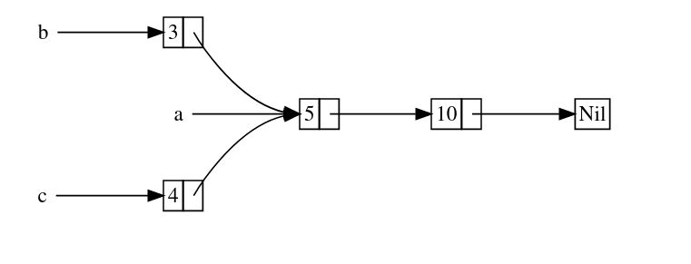

# Rust Language


Desde Wikipedia;
```
Rust es un lenguaje de programacion multiparadigma, de alto nivel y de proposito general, diseñado para el rendimiento y la seguridad, especialmente la concurrencia segura. Rust es sintácticamente similar a C++, pero puede garantizar la seguridad de la memoria utilizando un verificador de préstamos para validar las referencias. Rust logra la seguridad de la memoria sin recoleccion de basura, y el conteo de referencias es opcional.

Rust fue diseñado originalmente por Graydon Hoare en Mozilla Research[18], con contribuciones de Dave Herman, Brendan Eich y otros. Los diseñadores perfeccionaron el lenguaje mientras escribían el motor de navegacion experimental Servo y el compilador de Rust. Su uso ha aumentado en la industria, y Microsoft ha experimentado con el lenguaje para componentes de software seguros y críticos.

Rust ha sido votado como el "lenguaje de programacion más querido" en la encuesta de desarrolladores de Stack Overflow cada año desde 2016, aunque solo lo utilizo el 7% de los encuestados en la encuesta de 2021.
```

## Nota de ShyanJMC
Si no quieres (o no puedes) instalar Rust en tu sistema por muchas reasiones que tengas, puedes usar el intérprete oficial online;
https://play.rust-lang.org/


## Historia
De Wikipedia;
```
El lenguaje surgio de un proyecto personal iniciado en 2006 por el empleado de Mozilla Graydon Hoare, quien declaro que el proyecto posiblemente se llamaba así por la familia de hongos del oxido. Mozilla comenzo a patrocinar el proyecto en 2009 y lo anuncio en 2010. Ese mismo año, el trabajo paso del compilador inicial (escrito en OCaml) al compilador autoalojado basado en LLVM y escrito en Rust. Llamado rustc, se compilo con éxito en 2011.

La primera version prealfa numerada del compilador de Rust se produjo en enero de 2012. Rust 1.0, la primera version estable, se publico el 15 de mayo de 2015. Después de la 1.0, las versiones estables puntuales se entregan cada seis semanas, mientras que las características se desarrollan en Rust nocturno con versiones diarias, y luego se prueban con versiones beta que duran seis semanas. Cada 2 o 3 años, se produce una nueva "Edicion" de Rust. Esto es para proporcionar un punto de referencia fácil para los cambios debido a la naturaleza frecuente del calendario de lanzamiento del tren de Rust, así como para proporcionar una ventana para hacer cambios de ruptura. Las ediciones son ampliamente compatibles.

Junto con la tipificacion estática convencional, antes de la version 0.4, Rust también soportaba tipestatos. El sistema de tipado modelaba aserciones antes y después de las sentencias del programa, mediante el uso de una sentencia de comprobacion especial. Las discrepancias podían ser descubiertas en tiempo de compilacion, en lugar de en tiempo de ejecucion, como podría ser el caso de las aserciones en el codigo C o C++. El concepto de typestate no era exclusivo de Rust, ya que se introdujo por primera vez en el lenguaje NIL. Los typestates se eliminaron porque en la práctica se utilizaban poco, aunque la misma funcionalidad se puede conseguir aprovechando la semántica de movimiento de Rust.

El estilo del sistema de objetos cambio considerablemente en las versiones 0.2, 0.3 y 0.4 de Rust. La version 0.2 introdujo las clases por primera vez, y la version 0.3 añadio varias características, incluyendo destructores y polimorfismo mediante el uso de interfaces. En Rust 0.4, se añadieron los rasgos como medio para proporcionar herencia; las interfaces se unificaron con los rasgos y se eliminaron como una característica independiente. También se eliminaron las clases y se sustituyeron por una combinacion de implementaciones y tipos estructurados.

A partir de Rust 0.9 y hasta Rust 0.11, Rust tenía dos tipos de punteros incorporados: ~ y @, simplificando el modelo de memoria del núcleo. Reimplemento esos tipos de puntero en la biblioteca estándar como Box y (el ahora eliminado) Gc.

En enero de 2014, antes de la primera version estable, Rust 1.0, el editor jefe de Dr. Dobb's, Andrew Binstock, comento las posibilidades de que Rust se convirtiera en un competidor de C++ y de los otros lenguajes emergentes D, Go y Nim (entonces Nimrod). Según Binstock, aunque Rust era "ampliamente considerado como un lenguaje notablemente elegante", su adopcion se ralentizo porque cambiaba repetidamente entre versiones.

Rust tiene una interfaz de funcion extranjera (FFI) que puede ser llamada desde, por ejemplo, el lenguaje C, y puede llamar a C. Mientras que llamar a C++ ha sido historicamente un reto (desde cualquier lenguaje), Rust tiene una biblioteca, CXX, para permitir llamar a o desde C++, y "CXX tiene una sobrecarga nula o insignificante".

En agosto de 2020, Mozilla despidio a 250 de sus 1.000 empleados en todo el mundo como parte de una reestructuracion corporativa causada por el impacto a largo plazo de la pandemia de COVID-19. Entre los despedidos se encontraba la mayor parte del equipo de Rust, mientras que el equipo de Servo se disolvio por completo. El suceso desperto la preocupacion por el futuro de Rust.

A la semana siguiente, el equipo central de Rust reconocio el grave impacto de los despidos y anuncio que los planes para una fundacion de Rust estaban en marcha. El primer objetivo de la fundacion sería tomar la propiedad de todas las marcas y nombres de dominio, y también asumir la responsabilidad financiera de sus costes.

El 8 de febrero de 2021 la formacion de la Fundacion Rust fue anunciada oficialmente por sus cinco empresas fundadoras (AWS, Huawei, Google, Microsoft y Mozilla).

El 6 de abril de 2021, Google anuncio el apoyo a Rust dentro del proyecto de codigo abierto Android como alternativa a C/C++.
```

## Componentes
- Cargo

Cargo es el gestor de paquetes y dependencias para los programas Rust. Permite descargar e instalar dependencias para tus programas Rust.

Para crear un nuevo proyecto;
```rust
cargo new [project_name]
```

Para construir el proyecto;
```rust
cargo build [--release or not]
```

Para construir y luego ejecutar el proyecto;
```rust
cargo run
```

Para verificar el proyecto;
```rust
cargo check
```

- Rustfmt

Rust Format es el programa central que toma el programa de Rust como entrada y luego reemplaza los espacios y tabulaciones para formatear el codigo en cumplimiento de la guía de estilo de Rust.

- Clippy

Clippy es la herramienta integrada en Rust para mejorar el rendimiento y la legibilidad del codigo. Clippy tiene más de 400 reglas en 2021.

- Rustc

Es el compilador de Rust. Puede establecer argumentos por defecto a rustc estableciendo la variable; RUSTFLAGS . Mis argumentos reales para cada ejecucion de rustc son;
```rust
export RUSTFLAGS="-C target-feature=+crt-static -C target-cpu=native -C link-arg=-s"
```

- Rustup

Es una cadena de herramientas (un conjunto de herramientas) para instalar y utilizar rust para diferentes objetivos (sistemas y arquitecturas en las que se ejecutará el programa). También es la mejor manera de instalar y mantener actualizado rust, esto es porque es agnostico del sistema operativo y no necesita acceso de administracion/root para instalar rustc, cargo, etc-.

Para instalar rustup
```rust
curl --proto '=https' --tlsv1.2 https://sh.rustup.rs -sSf | sh
```

Para actualizar rustup y el toolchain
```rust
rustup update
```

Para desinstalarlo
```rust
rustup self uninstall
```

## Teoría
Rust como muchos otros lenguajes de programacion;

- Compilador

Es el componente que toma el codigo y lo transforma en codigo máquina (codigo binario, bits (0 y 1) con formato específico) con una estructura específica (no es solo leer y ejecutar las instrucciones, debe ser una estructura específica) e informacion. Con esas estructuras e informaciones adicionales, la CPU puede trabajar de forma específica y ejecutar correctamente lo que el desarrollador le indique.

- Pre procesador

Son opciones dentro del codigo que indican al compilador algunas cosas específicas a corroborar/hacer en el momento de la compilacion.

- Variable

Una variable es algo así como un "contenedor", esto es porque puede contener un tipo de informacion; número, cadenas o caracteres. Identifica con un nombre [nombre_de_la_variable], la informacion almacenada en memoria, así que cuando quieras acceder a esa informacion puedes hacerlo usando el nombre de la variable como identificador.

Las variables en Rust se pueden crear con;
```rust
let [variable_name] = [value];
```

o si queres especificar el tipo de variable;
```rust
let [variable_name]: [type] = [value];
```

En Rust, si una variable no se utiliza intencionadamente en condiciones específicas, debe anteponerse un guion bajo; \_[variable]

- Estructura

Es una coleccion de variables bajo la misma estructura fuera de la funcion específica. Se utiliza para agrupar variables con el mismo proposito.

- Funcion

Es una pieza de codigo que hace una cosa específica. En muchos lenguajes hay muchas formas de hacerlo pero en C,C++,Rust y otros la forma de hacerlo es poner el codigo entre; { y }. El compilador también debe saber cuando un trozo de codigo corresponde a una funcion, por lo que antes del nombre debe estar la palabra "fn".

Por ejemplo;
```rust
fn [function_name] ( [arguments] ) -> [return_type] {
	[code];
	[code];
	[code];
}
```

La funcion puede devolver al llamante un valor, por ejemplo; ejecutamos alguna operacion matemática y el retorno al llamante es el resultado de la misma.

La parte de la funcion en la que se declara la palabra clave "fn", y el nombre de la funcion como argumentos y tipos de retorno se llama; firma.

- Método

A veces se llaman "objetos". Es similar a las funciones pero un método se utiliza en el contexto de una estructura, enum o trait). Los métodos tienen como primer argumento "self". Como las funciones, los métodos toman el retorno de la funcion y trabajan con ella.

- Argumentos

Un argumento es la informacion que se pasa al programa o a la funcion para trabajar con ella.

Verás en el futuro que habrá un argumento llamado "&self" que significa sí mismo. Que se utiliza cuando se crea un método que se utiliza para tomar los retornos de otra funcion.

- ASCII / UTF

ASCII y UTF son estándares de codificacion de caracteres (números, letras y símbolos) para la comunicacion electronica. Los UTF tienen variantes de 1,7,8,16 y 32 bits. Estos estándares utilizan una combinacion de bits para representar tantos símbolos como sea posible.

- Instruccion

Una instruccion es una orden de ejecucion. Puede ejecutar cualquier cosa que el lenguaje soporte.

Pero lo cierto es que cada instruccion que ejecuta tu codigo es realmente una funcion (o una macro).

- Comparaciones

Una comparacion en Rust solo puede hacerse entre valores del mismo tipo.

Solo puedes comparar variables, o valores, del mismo tipo. No puedes comparar un número entero con una cadena, por ejemplo, solo int con int, char con char y cadena con cadena. Sí, debes convertir todo a tabla ASCII si necesitas comparar pero te proporcionará más retos.

En Rust si pones en una comparacion " _ " significa "cualquier cosa".

- Cabeceras / Bibliotecas

Cada lenguaje de programacion tiene cabeceras/bibliotecas. Son colecciones de funciones (y otras informaciones) en un archivo que cualquier desarrollador puede utilizar en su propio codigo. Por ejemplo, usted puede utilizar la biblioteca estándar y no tendrá que desarrollar la informacion y el estándar para proporcionar el conocimiento a rustc lo que es un int, char, etc.

- Socket

Un socket es un tipo especial de cosa. Un socket permite que un programa se comunique con otros programas transfiriendo informacion, este tipo de comunicacion puede ser en local (sockets de dominio Unix, en los que el programa puede comunicarse con otros en el mismo ordenador que se está ejecutando) o a través de internet (TCP/IP, UDP y otros). Sí, internet se basa en clientes y servidores que interactúan a través de sockets de internet en sus sistemas operativos.

- Depuracion
La depuracion es un proceso en el que se toma un programa XX y se analiza su funcionamiento (con la ayuda de símbolos específicos dentro del programa) para encontrar y solucionar problemas.
El proceso permite también encontrar maneras de hackearlo y crackearlo. Siempre hay que liberar los programas a otros sin símbolos de depuracion.

- Extensiones de archivos

Los programas y librerías de Rust tienen la extension ".rs".

- Espacios de nombres y objetos

Un nombre es un alias para los signos. Un signo permite identificar un recurso específico a un objeto específico. Si muchos objetos tienen las mismas funciones, llamadas y/o interfaces, el espacio de nombres puede permitir rastrearlas a un objeto específico.

De acuerdo, un espacio de nombres rastrea una cosa a un objeto específico, pero ¿qué es un objeto?
En general y tratando de incluir todos los paradigmas; Un objeto es una pieza de cosa que tiene una interfaz (la forma en que interactúan con otros objetos). Dentro del objeto hay muchas piezas de informacion que pueden o no depender del entorno externo al objeto. Esa informacion dentro del objeto puede ser propiedades y atributos.

Esta explicacion sirve para la programacion, los sistemas operativos, las bases de datos, las redes, los contenedores, la virtualizacion, etc. Cada uno de ellos tiene una aplicacion específica de un objeto.

- Array

Un array es una coleccion de elementos (todos con el mismo tipo) bajo el mismo nombre, pero cada elemento tiene su propia posicion en la memoria.

- Puntero

Un puntero es eso. Un puntero a algo (informacion de la RAM, sobre variables, etc). En Rust se referencian con "&", no tienen ninguna capacidad especial aparte de referirse a los datos, y no tienen sobrecarga.

- Puntero inteligente

A diferencia de los punteros normales, los punteros inteligentes amplían sus capacidades como estructuras de datos. Otra diferencia es que los "punteros inteligentes" toman la propiedad de los datos apuntados, los punteros normales no.

Los tipos "String" y "Vec" son punteros inteligentes.

- Crate

En Rust, un create agrupará funcionalidad relacionada en un alcance para que la funcionalidad sea fácil de compartir entre múltiples proyectos. Esto es lo que en otros lenguajes se llama "headers" y/o "libraries".

En un proyecto de Cargo, el crate librarie está en; "src/lib.rs"

La diferencia es que en Rust incluso "main.rs" (el futuro binario) es una creacion.

En Rust puedes encontrar el repositorio central de crates en;
https://crates.io/

- Modulo

Como un create es un grupo de funcionalidad, el modulo es el grupo de codigo. Un modulo contiene una o más funciones.

Así que un create puede agrupar muchos modulos como los desarrolladores quieran, y cada modulo tiene funciones relacionadas (en el objetivo). Pero hay una cosa muy importante; un modulo puede tener dos tipos de codigo; un codigo privado (en el que solo el modulo o la funcion del modulo puede usarlo) o público (en el que puedes llamarlo desde tu codigo externo).

- Iterador

"Iterar" es la accion de procesar y trabajar con cada elemento de una serie, y un iterador es justo la forma de hacerlo.

En Rust los iteradores se compilan en un nivel mucho más bajo que otros codigos.

- Ejecucion concurrente
Es cuando diferentes partes de un programa se ejecutan independientemente.

- Ejecucion paralela
Es cuando diferentes partes de un programa se ejecutan al mismo tiempo. La principal diferencia dentro de la ejecucion concurrente es que las diferentes partes a pesar de ejecutarse al mismo tiempo, dependen unas de otras de alguna manera.

- Hilo de ejecucion
Es un trozo de codigo que se ejecuta de forma concurrente o paralela.

## Estructura del proyecto Cargo

Cuando creas un nuevo proyecto con cargo (la forma recomendada de usar los proyectos de rust) con "cargo new [nombre_de_proyecto]" hay algunas cosas que debes saber;

- Puedes integrar git con cargo añadiendo el argumento; -\-vcs=git
- El archivo "Cargo.toml" es el archivo de configuracion del proyecto que contiene el nombre del proyecto, la version, la edicion y la misma informacion para todas las dependencias.
     - Las secciones de Cargo.toml:
"[profile.XXXXXX]":

Aquí se personaliza "dev" y "release" especificando las banderas de compilacion en las secciones "[profile.XXXXX]".

"[package]":

Aquí puedes usar claves como; "name" (para el nombre del paquete), "license" (para especificar la licencia del paquete. Ten en cuenta que si publicas tus librerías en crates.io deben ser de codigo abierto), "version", "description", "version", etc.

"[dependencies]":

Aquí puedes especificar qué crates externas vas a utilizar dentro de tu codigo.

Y otras secciones.

- In src/ directory (or folder, is the same thing with differents name) you must put your program's files and your headers / libs (crates). By default there is file; main.rs.
- If just exist "main.rs", the crate root will be it. If exist "lib.rs" the crate root file will be it.
- In target/ directory you will find the executable program based in two things;
     - The target (CPU architecture and operative system); is not the same compile for AArch64 using x86 than compile for BSD using Linux, each compilation will have the respective folder. My reccomendation is always compile for your specific CPU if you will not distirbute the binary file.
     - If is a release or debug; just for internal use is reccomended use debug release, for release to public must be used "release" because with it will apply optimizations and the final executable will be smaller.

For complete understanding see online documentation;

https://doc.rust-lang.org/cargo/

## Libraries

You will can not do much without the respectives standard libraries. In Rust you can use libraries with; "use".
A library is a compilation of functions, structs and other code. All inside same file, so you can access many functions and features from another files:

```rust
use [library]::[specific_function_or_information];
```

Si no se especifica la funcion o la informacion a importar de esa biblioteca, se importará toda la lib.

Por defecto, como mínimo, necesitará:

```rust
use std::io;
```

En este punto sabes (con el ejemplo anterior) que tienes una lib llamada "std" (abreviatura de "standard") y estás importando de ella una coleccion de funciones de "io".

## Variables
Como dijimos antes, una variable es un contenedor que almacena un tipo específico de informacion.

Por defecto, el compilador de Rust interpreta la informacion que será asignada a la variable y formatea la variable a ese tipo. Si quieres especificar el tipo de variable la sintaxis es esta;
```rust
let [variable_name]: [type] ;
```

En Rust por defecto cuando se crea una variable es inmutable (lo que significa que no cambiará con el tiempo) así que si creaste la variable pero luego necesitas cambiar el valor, tienes dos opciones;

- Sombrearla; esto significa que declararás de nuevo la variable que sobrescribirá la antigua con un nuevo valor.

```rust
let var1 = 5;
[operations];
let var1 = 3;
```

- Configurarla como mutable; no es la mejor solucion, pero si sabes que el valor de la variable cambiará con el tiempo después de "let" especifica "mut":
```rust
let mut [variable_name];
```

## Tipos
Hay muchos tipos de valores que puedes utilizar en tu codigo;
### Números
Hay dos tipos de números en Rust; enteros (conocidos como números sin parte fraccionaria. ), y números con decimales (conocidos como "float").
  - El tamaño de estos tipos (cuál es el valor más alto que puede contener) depende del número de bits que se utilicen para almacenarlo y representarlo.
  - Los números enteros se representan como "iX" y los números flotantes como "fX". La letra "X" es el número de bits a utilizar (8,16,32,64 y 128 bits están disponibles), los floats solo pueden utilizar 32 o 64 bits (en 2021 la velocidad en 64 bits es igual o superior a la de 32 bits, así que utiliza 64 bits).

```rust
let intvar1: i64 = 32000;
let floatvar2: f64 = 32.0001;
```

o si no especifica los tipos puede simplemente asignar el valor.

  - Ambos (int y float) pueden tener signo (lo que significa que pueden ser positivos o negativos) o sin signo (lo que significa que pueden ser solo positivos). Los enteros y flotadores con signo se representan como "iX" y "fX" respectivamente. Los enteros sin signo se representan como "uX".
  - Los enteros pueden representarse como decimales (por defecto), hexadecimales (0x[XXXXX]), octales (0o[XXX]), binarios (0b[XXXXX]) y como un byte (solo u8) (b'X').


Los números también tienen una buena característica: las tuplas. Una tupla es una forma general de agrupar un número de valores con una variedad de tipos en un tipo compuesto. Las tuplas tienen una longitud fija: una vez declaradas, no pueden crecer ni reducir su tamaño.

```rust
let variable1: (i32,i64,i8) = (128,32000,233);
```

Pero si intentas impresionar en pantalla la variable1 no podrás, eso es porque el compilador de Rust no sabe a qué valor estás haciendo referencia. Por eso Rust implementa otra buena característica para asignar una variable a cada valor de la tupla:

```rust
let variable1: (i32,i64,i8) = (128,32000,123);
let (x,y,z) = variable1;
```

Con el ejemplo anterior, creamos una tupla con un entero de 32 bits (el número 128), un entero de 64 bits (el número 32000) y un entero de 8 bits (el número 123). Luego creamos 3 nuevas variables (x,y y z) en las que asignamos los valores en orden (x -> 128, y -> 32000 y z -> 123). Este proceso se llama; desestructuracion.

Pero también las tuplas tienen la ventaja de indexar partes, por lo que usando el punto (".") puedes usar partes específicas de una tupla. Recuerda, en langagues (o en la mayoría de ellos) las tuplas, arrays y listas comienzan en cero (porque se basa en el número de cambio de posicion);

```rust
let variable1: (i32,i64,i8) = (128,32000,123);
let x = variable1.0;
```

Con abose X la variable tendrá el valor 128. Si el número era 1, X tenía 32000.

### Símbolos
Los símbolos pueden ser letras individuales (conocidas como "char") y una cadena de caracteres (conocida como "string"). Técnica e internamente Rust llama a las letras como "grupos de grafemas".
  - Cuando es un carácter, el mismo debe estar entre comillas simples 'X'.
  - Cuando es una cadena, la misma debe estar dentro de comillas dobles "XXXX".
  - Las cadenas se representan como "str" en su forma más primitiva y "String" como la más moderna, la diferencia es que un tipo "str" es una secuencia inmutable de bytes UTF-8 y "String" es una secuencia mutable. Ambos son dinámicos (esto quiere decir que se pueden asignar directamente sin tener en cuenta el leght de entrada). Así que debes usar "str" cuando uses una cadena de entrada que no cambiará con el tiempo y debes usar "String" cuando necesites almacenar una cadena de entrada que cambiará/puede cambiar con el tiempo.

Nota; a diferencia de muchos otros lenguajes, en Rust no se pueden indexar palabras en una Cadena.

  Las diferencias entre "str" y "String" son;
  1. String es cultivable, puede crecer con el tiempo.
  2. String es mutable, "str" no.
  3. String es owned, ver capítulo "Ownership".
  4. 4. Las cadenas soportan la codificacion "UTF-8", que es la que se desea desde 2012. Por lo tanto, no siempre la longitud de una variable en la memoria será igual a los números de las palabras, debido a eso (sobre la codificacion UTF-8 y como almacenar las letras y los símbolos en la memoria) no se puede indexar palabras en una variable de cadena. Rust proporciona diferentes formas de interpretar los datos de cadena en bruto que los ordenadores almacenan para que cada programa pueda elegir la interpretacion que necesita, sin importar en qué lenguaje humano estén los datos, así que ten cuidado si almacenas datos en una variable de cadena como bytes, valores escalares o clusters de grafeno porque debes leer de la misma forma para leer correctamente los datos.

Algunas de las funciones en Strings son;
  1. "String::new()" : Crea una nueva variable de cadena vacía.
  2. "String::from(XX)" : Crea una nueva variable de cadena a partir de XX.
  3. ".push_str(XX)" : Añade "XX" a una variable de cadena existente.
  4. V1 + V2 : Puedes añadir la variable de cadena V2 al final de la variable de cadena V1. Pero "V1" y "V2" no serán más largas bajo puntuacion si no se usan por referencia, ver capítulo "Propiedad". Este operador utiliza el método "add", pero utiliza "str" como V2, así que tenga cuidado porque "str" y "String" no son lo mismo y pueden causar problemas.
  5. "format!("{} {} {}", V1,V2,V3,VN) : Es lo mismo que "+". Funciona igual que "println!" pero en lugar de imprimir en stdout, lo almacena en una variable como retorno. El tipo de retorno es String. Una cosa sobre esta opcion es que no toma la propiedad.
  6. ".to_string" : Convierte una cadena en un valor con formato de cadena.

  - Booleanos; verdadero o falso.

Mientras que las tuplas solo pueden ser intergers, los tipos de listas de arrays pueden ser de cualquier tipo, pero solo un tipo para todos los elementos.

```rust
let list1 = [1,2,3,4,5,6];
let list2 = ['a','b','c','d','e','f'];
let list3 = ["Hello","World","Rust","rules!"];
```

Por lo demás, las listas de tuplas y arrays funcionan de la misma manera.
Como en el ejemplo anterior; recuerda que los caracteres van con comillas simples y las cadenas con dobles.

¿Pero qué pasa si tienes una tupla con 35 tipos iguales? Puedes especificarlo con 2 declaraciones;

```rust
let variable1: [i32; 5] = [1,2,3,4,5];
```

Como puedes ver hay muchas diferencias; en lugar de () para el tipo, se especifica con [], el número de ese tipo se separa con ";" y la lista va con [] en lugar de ().
¿Y qué pasa si tienes 345 valores del mismo tipo? Pues lo mismo que antes pero ahora con valores en lugar de

```rust
let array5 = [34; 320000];
```

Con el ejemplo anterior, array5 es una variable con 320000 valores. Cada valor de esos 320000 tiene "34" como valor.

Cada valor dentro de una variable está indexado en la variable, de la misma manera que las tuplas. El primer valor (de izquierda a derecha) tiene la posicion cero (0), el siguiente tiene la posicion uno (1), etc. Pero en este caso, el acceso no es con "." (punto), es con "[X]":

```rust
let array6 = ["Hello"," ","World"," ","How"," ","are"," ","you","?"];
let variable7 = array6[0];
```

Con el ejemplo anterior, tenemos una variable llamada "array6" que tiene 10 posiciones (de 0 a 9. Recuerda que los arrays y las tuplas empiezan por cero). Como "variable7" se toma el valor de la posicion cero de array6, el valor es "Hola", si el array era "1" entonces el valor es " " (espacio), y si era "9" entonces el valor es "?".

### Punteros
Como dijimos en la seccion de teoría, un puntero es eso; un puntero a algo. Ese "algo" puede ser cualquier cosa que exista; alguna informacion en la RAM, otras variables, etc.

Por ejemplo;

```rust
fn main() {
    let information = "Hello World".to_string();
let variable1 = &information;
println!("{}",variable1);

}
```

El codigo anterior creará una variable llamada "informacion" que contiene la cadena "Hola Mundo" pasada como corresponde por la funcion ".to_string()". Esto último permite imprimir una cadena en pantalla.

Entonces la variable "variable1" es un puntero; porque está haciendo referencia a la memoria RAM de "informacion" con el símbolo; &

Así que "variable1" será un puntero a "informacion". Cuando el segundo cambio, el primero también.

En el codigo anterior "variable1" apuntando a "informacion" está tomando como informacion a "Hola Mundo".

Hay muchas formas de utilizar los punteros, pero es la más sencilla.

### Slice

Es más utilizado en los retornos de las funciones, el slice se especifica con; "?" y significa que no se sabe exactamente lo que se va a devolver. Es muy útil cuando se obtiene alguna informacion general (como un String) y no se sabe que es lo que se va a devolver específicamente.

Ejemplo;
```rust
fn function1() -> ? {
	[code];
	[return_known]
}
```

### Estructura

Una estructura, es un tipo que permite agrupar variables dentro de un dominio logico. Al igual que las tuplas, en las estructuras hay que declarar las variables que contendrán los valores.

Cada variable dentro de la estructura se llama campo. Una estructura sin archivos se llama estructura unitaria

Sintaxis;
```rust
struct [struct_name] {
	[variable1]: [type],
	[variable2]: [type],
	[variableN]: [type],
}
```

Para acceder a modificar o leer los valores, primero hay que crear una variable. Esa variable tendrá la propiedad de esa estructura, y a través de esa variable se accederá a la estructura. Cuando creas esa variable, no debes asignar un tipo, ya que el valor debe ser [nombre_de_la_estructura] y luego especificarás a través de { ...} el valor de cada componente.

Pero si esa variable fue declarada antes puedes usar esta sintaxis para leer/escribir (si esa variable es mutable, por supuesto); [nombre_variable].[componente_estructura]

Por ejemplo;

```rust
struct User{
    email: String,
    age: u32,
}

fn main() {
    let mut var1_structure = User{
        email: String::from("shyanjm_protonmail.com"),
        age: 0,
    };
    var1_structure.age = 43;
    println!("Struct User from instance var1_structure: {} {}", var1_structure.email, var1_structure.age);
}
```

Como puedes ver, hay algunas diferencias al usar structs:

- Los valores se asignan con : no con igual =.
- Cuando se inicializa el struct, hay que initear todas las variables, aunque se les proporcione el valor correcto antes.
- Usando el punto . puedes acceder a los datos sin problemas si la variable fue declarada antes (incluso si son otros structs).
- No se puede impresionar directamente una estructura, porque Rust no sabe como formatearla.

Y si quieres devolver un struct, simplemente pon el nombre del struct como tipo de retorno. Pero no puedes pasar una estructura directamente, debes pasar los componentes.

Si integras una estructura en una funcion, y si el nombre del argumento es exactamente el mismo que los campos, puedes poner el nombre y Rust asignará directamente el valor (esto se llama; Init shortland). Pero en mi opinion, es solo una palabra, por lo que poner los nombres es una de las mejores prácticas que puedes hacer; hacer que tu codigo sea fácil de leer para otros sin importar el nivel de experiencia.

Otra cosa que puedes hacer para ahorrar tiempo es asignar, con una operacion de copia, el resto de variables de la estructura A a la estructura B. Como he dicho antes, en mi opinion es mejor escribir más pero hacer el codigo más fácil de leer y entender que ahorrar unas pocas líneas de codigo, pero aquí la sintaxis;

```rust
let user2 = User {
	email: String::from("another@example.com"),
	..user1
};
```

Ese codigo creará una instancia de la estructura de usuario en el campo email y hará una operacion MOVE del resto de campos de user1 para que no estén disponibles en la estructura de user1. Para esta parte ve a la seccion "Propiedad".

También como en el caso de los structs se pueden crear tipos aduaneros usando las primitivas (enteros, floats, etc) pero recuerda, no asignes el struct como tipo, el struct asignado como valor es el tipo self. Con ello al igual que vimos antes puedes agrupar los tipos en tuplas, la sintaxis es;

```rust
struct [struct_name]([type],..,..);
```

por ejemplo;

```rust
struct Position3d(i64,i64,i64);

let position1 = Position3d(64,32,0);
```

Hay algunos puntos sobre las tuplas struct que debes tener en cuenta cuando trabajes con ellas;

- Una tupla struct no puede ser pasada como argumento/parámetro a otra.
- Todavía puede acceder a cada parte de la tupla normalmente como cualquier tupla con punto . o como array.

## Funciones
La primera funcion que verás es "main".

```rust
fn main(){
	[code];
}
```

Esa funcion es donde su programa comienza. Una funcion no se ejecutará a menos que sea llamada dentro de "main".

Si vienes de C, C++ y otros sabes que cada funcion después de "main" producirá un error al intentar compilar y por eso debes usar prototipos para arreglarlo. En Rust esto no es necesario, puedes poner todas las funciones que quieras después de "main".

Verás que dentro de la funcion "main" hay "println!". El "!" indica que no es una funcion, es una macro (lo veremos en el futuro).

Las funciones tienen esta sintaxis;
```rust
fn [function_name]( [arguments] ) -> [Return_type] {
	[code];
	[code];
	...
}
```

Con el ejemplo anterior;
- [function_name]

     Este es el nombre de la funcion, se utiliza para saber como llamarla y donde se llama.

- [arguments]

     Los argumentos son las opciones que se pasan al programa.

- [Return_type]

     Una funcion puede devolver a quien la llama un valor. Este valor puede ser cualquier cosa reconocida como tipo en Rust .


Dentro de Rust el retorno se especifica en el codigo de la funcion con la palabra "return" o simplemente poniendo una variable o valor. Así que ese valor será devuelto a la variable o funcion que lo llamo. En lugar del resto del codigo, el retorno va sin el punto y coma ";" al final de la línea.

De StackOverflow;

> Se puede omitir la palabra clave return solo si el valor devuelto es la última expresion del bloque de funciones, de lo contrario es necesario utilizar explícitamente return

Si el argumento se especifica así

```rust
&[String]
```

Significa que el argumento es un array de cadenas, se puede acceder directamente como un array.

Hay una lista de funciones y macros comunes.

### println!
Se utiliza para imprimir en pantalla. La sintaxis es;

```rust
println!(" [text] {}", variable_X);
```

El [text] es la cadena de texto que se quiere imprimir en pantalla.

Los "{}" indican a Rust que debe existir el valor de la "variable_x", para en tiempo de ejecucion reemplazar los {} con el valor de la variable_x. Puedes añadir tantos {} y variables como quieras.

"Println!" imprime el mensaje a stdout.

### eprintln!
Funciona de la misma manera que "println!" pero imprime el mensaje a stderr. Que se utiliza para imprimir solo los problemas.

### String
Esta librería asignada en rust estándar devuelve una cadena.

Hay muchas formas de almacenar y usar cadenas en variables.

- Para crear una cadena vacía en una variable:
```rust
let [variable_name] = String::new();
```

- Para almacenar un string en una variable:
```rust
let [variable_name] = "[TEXT]".to_string();
```

o
```rust
let [variable_name] = String::from("[TEXT]");
```

o
```rust
let [variable_name]: String = "[TEXT]".into();
```

Esta última línea "into" transformará [TEXT] en String, porque es el tipo de texto.

- Para añadir una cadena a otra variable de cadena:
```rust
[variable_name].push_str([TEXT_OR_STRING_VARIABLE]);
```

o
```rust
[variable_1] + [variable_2]
```

o
```rust
[variable_to_store] = format!(".... {} {} {} {} ...", var1, var2, var3, varn);
```

- Para convertir de string a un vector de letras:

```rust
[string_variable].chars()
```
es una buena opcion usar esto con una iteracion.

- Para iterar sobre cada letra:
```rust
for X in [string_variable].chars() {
    .....
}
```

### .to_lowercase()
Esta funcion hace lo que su nombre indica, transformar alguna Cadena en equivalente a minúsculas.

La sintaxis es;
``rust
[str_o_cadena_variable].a_minúsculas()
```

### .contains(XXXX)
Este método/funcion toma la entrada y procesa si tiene "XXXX". La entrada puede ser "str", String, char, o slice of chars.

Devuelve "True" como '()' si es correcto o "False" si no se encontro nada.

La sintaxis es;
```rust
let cadenas = "hola mundo".to_string();
let return1 = assert!(cadenas.contiene("mundo"));
```

### .lines()
Este método/funcion toma el imput y crea una iteracion sobre cada línea (puedes establecer la nueva línea en una cadena con "\n"). Puedes ir a la siguiente línea con ".next()" y si vas al final de la línea el retorno será "None".

La sintaxis es;
```rust
let texto = "foo\r\nbar\n\nbaz\n";
let mut lines = text.lines();

assert_eq!(Some("foo"), lines.next());
assert_eq!(Some("bar"), lines.next());
assert_eq!(Some(""), lines.next());
assert_eq!(Some("baz"), lines.next());

assert_eq!(None, lines.next());
```

### io::stdin()
Como puedes ver en el nombre, la funcion es "stdin" de la lib "io".
Esta funcion toma la entrada y la procesa dentro de una estructura (en un buffer global), para que pueda ser manejada adecuadamente en una variable.

La sintaxis es;

```rust
let [mut_o_no] [nombre_variable] = io::stdin();
```

o si tienes una variable previamente mutable formateada como tipo cadena:

```rust
let [mut_or_not] [nombre_variable2] = stdin.read_line(&mut [nombre_variable])?;
```
Necesitamos crear una nueva variable porque "stdin" tiene un valor de retorno que debe ser almacenado en algún lugar, a menos que uses "expect".
Como el imput se almacena dentro de un buffer global, puedes forzar el bloqueo de ese buffer para que tu thread sea el único que pueda acceder y leer/escribir en él. Con esto usas una sincronizacion explícita;

```rust
let stdin = io::stdin();
let mut [nombre_var1] = stdin.lock();
¿[nombre_variable].read_line(&mut [nombre_variable])?;
```

### Esperar()
Este es un objeto especial.
Se usa si quieres imprimir en pantalla algo cuando la funcion anterior da error.

```rust
[funcion_anterior_o_variable].expect("[TEXTO]");
```
Con el ejemplo anterior si por alguna razon la primera funcion va a error se pasará a "expect" e impresionará [TEXT].

Ten en cuenta esto; "expect" toma "str" como entrada, por lo que no puedes pasar una cadena directamente, necesitas convertirla primero. Ese retorno "str" de la funcion, objeto, variable o método anterior es un retorno "Err". No es un retorno normal, el tipo es "Err".

### read_line( [variable] ) and read_line_prompt(msg: &str)
Este objeto funciona con "stdin()" porque lee una línea (atencion, una línea) y la almacena en [variable] que debe ser una variable formateada como cadena.
```rust
stdin().read_line(&mut [variable]);
```

Puedes usar la variacion; read_line_prompt(msg: &str).

Esa funcion muestra al usuario la cadena pasa como argumento ( el texto beetwen cuotas dobles ) antes de llamar a read_line para almacenar la entrada.

### parse()
Como muchas funciones, este es uno de los objetos más útiles en Rust.

Sintaxis;
```rust
[variable_target]: [nuevo_tipo] = [variable1].[otro_objeto_o_no].parse()
```

Parse transformará un trozo de cadena de [variable1] en otro tipo, generalmente en el tipo objetivo de la variable.

Seguro que utilizarás mucho este método.

### trim()
Este es un objeto muy útil.

Sintaxis;
```rust
[variable].[funcion_recortar];
```

- "trim()" elimina los espacios en blanco iniciales y finales y las tabulaciones de una cadena.
- "trim_start()" solo elimina los espacios en blanco iniciales y las tabulaciones de una cadena.
   - nota

     trim_left ha sido reemplazado por "trim_start".

- "trim_end()" solo elimina los espacios en blanco finales y las tabulaciones de una cadena.
   - nota

      trim_right ha sido reemplazado por "trim_end".

- "trim_matches('[X]')" elimina el patron [X] de las posiciones iniciales y finales de una cadena.
- trim_start_matches('[X]')" elimina el patron [X] de las posiciones iniciales de una cadena.
- trim_end_matches('[X]')" elimina el patron [X] de las posiciones finales de una cadena.

### strip
Elimina de las cadenas el patron [XXXX]. Obviamente el retorno es una cadena a la variable pasada.

Sintaxis;
```rust
[variable].[strip_function];
```

- "strip_prefix("[XXXX]") " elimina el patron [XXXXX] de las posiciones iniciales de una cadena.
- "strip_suffix("[XXXX]") " elimina el patron [XXXXX] de las posiciones finales de una cadena.

### is_ascii()
Comprueba si la cadena tiene valores ASCII. Devuelve un tipo booleano.

Sintaxis;
```rust
[variable].is_ascii();
```

### len()

Devuelve el número de bytes del tamaño de la variable. Atencion; "número de bytes", NO "número de chars/etc" (sí, en la tabla ASCII cada valor usa 1 byte pero no será así para siempre). Devuelve interger.

Sintaxis;
```rust
[variable].len();
```


### is_empty()
Comprueba si la variable no tiene informacion en su interior. Devuelve un tipo booleano.

Sintaxis;
```rust
[variable].is_empty();
```

### as_bytes()
Transforma cada caracter en su equivalente en bytes. Devuelve el tipo entero.

Sintaxis;
```rust
[variable].as_bytes();
[variable].as_bytes_mut();
```

### Assert
Assert es una familia de macros para comparar una o dos cosas. El único comportamiento común es que encuentran que no coinciden con el resultado esperado, llamará ¡panic! y terminará el programa.

Esto se aplica no solo para variables y tipos comunes, también para retornos.

- Para comprobar si el retorno de algo es 'True';
```rust
assert!([cosa], [mensaje_para_mostrar_si_tiene_panico], [variables_si_el_mensaje_de_panico_tiene_variables]);
```

- Para comprobar si dos cosas son iguales;
```rust
assert_eq!([thing_1],[thing_2],[message_to_show_if_panic], [variables_if_panic_message_have_variables]);
```

"[cosa_1]" se llama por oxido "izquierda" y "[cosa_2]" se llama por oxido "derecha".

- Para comprobar si dos cosas no son iguales
``rust
assert_ne!([thing_1],[thing_2],[message_to_show_if_panic], [variables_if_panic_message_have_variables]);
```

"[cosa_1]" se llama por oxido "izquierda" y "[cosa_2]" se llama por oxido "derecha".

### Contiene
Las funciones Contains devuelven true si XXX está en el valor.

Hay muchas implementaciones y crates para probar bajo scope dependiendo del escenario y la variable objetivo;

1. std::slice::contains

2. std:str::contains

3. std::option::Option::contains

Etc.

### .clone()
Algunos no se copian implícitamente. El método clone implementa los comportamientos adecuados para copiar valores entre variables sin problemas.

Por ejemplo;
```rust
let var1= String::from("Hola Mundo");
let var2= var1.clone();
```

#### is_ok()
Este método comprueba si los resultados de algún tipo son "Ok(X)". Devuelve "true" o "false".

Por ejemplo;
``rust
let var1: Result<&str,&str> = Ok("Todo está bien");
assert_eq!(var1.is_ok(), true );
```


## Flujo de Control; if, else, else if, loop, while y for

Hay muchas formas de controlar el flujo del programa, todas esas formas son con una comparacion condicional; si esto es [algo] a esto otro, haz esto, si no haz esto otro.

### if, else y else if
La declaracion "if" es lo que piensas. Si la condicion es correcta haz el codigo dentro de "{}" si no continúa. Esta declaracion puede trabajar con números, cadenas y cualquier tipo estándar de oxido.

La condicion puede estar dentro de "()" pero probablemente el compilador de rust te dirá que los elimines, esto es porque intentará que lo evites si no son necesarios.

Por ejemplo para comparar dos números;

```rust
fn main() {
    let var1 = 45
    let var2 = 300;
    if var1 < var2{
        println!("{} es menor que {}",var1,var2);
    }
}
```

El codigo anterior probará si "var1" (con valor 45) es menor que "var2" (con valor 300), si esa condicion es cierta ejecutará el codigo whitin "{}", en este caso imprimirá en pantalla.

La sentencia "if" no solo puede funcionar con números, como he dicho antes; puede funcionar con cualquier tipo estándar de oxido.

En la condicion puedes usar cualquier funcion, incluso sus retornos;

```rust
fn main() {
    let var1 = "Hola Mundo";
    if var1.is_empty() != true {
        println!("{} no está vacío",var1);
    }
}
```

El codigo anterior creará una variable con la cadena "Hola Mundo", luego probará si "var1" está vacía.

Si el retorno del if es "true" no ejecutará nada, pero si no es (eso significa "!=") true ejecutará el codigo dentro de "{}".

Pero, ¿qué pasa si quieres hacer una prueba y tomar más de una accion teniendo en cuenta los retornos de la condicion? Fácil;

```rust
if [condicion] {
	[code_to_execute_if_condition_true];
}
else if [segunda_condicion]{
	[code_to_execute_if_the_first_condition_was_false_but_this_second_is_true];
}
else {
	[code_to_execute_if_all_conditions_are_false];
}
```

Puedes utilizar tantos "else if" como necesites.
Como puedes pensar, todos los retornos de las condiciones son de tipo bool (True o False).

Aquí algunas de las operaciones if, while, for y else (recuerda que puedes usar opteraciones normales, no solo aritméticas);
- a < b

Si a es menor que b.

- a > b

Si a es mayor que b.

- a == b

Si a es igual a b. No confundir con un igual simple; "=" que es un asignador, no una comparacion.

- a

Comprueba si a es igual a "True" (el valor booleano).

- !a

Comprueba si a es igual a "Falso" (el valor booleano).

El programa anterior es simple pero utiliza todos los conocimientos adquiridos hasta ahora. Primero importa el create; InputOutput de la librería estándar.

Luego crea una funcion llamada "f_t_c_fn" que toma como argumento "user_input" con tipo "String" (yo uso el mismo nombre del argumento que la variable que paso a la funcion, pero no es necesario).

En la funcion "f_t_c_fn", crear una variable mutable llamada "user_input2" con tipo "string" asignando como valor una cadena vacía. A continuacion cree dos variables float de 64bits llamadas "f_t_c" y "is_number".

Pida al usuario que impute valores leyendo la línea desde imput/otput estándar, guardando los valores en la variable mutable "user_input2". Si los valores imput fallan, mostrar el error "Error taking imput.".

El codigo bueno y el uso de objetos está aquí; el "user_input2" se pasará al objeto "trim", el resultado se pasará al objeto "parse", el resultado de esto se pasará a la variable "is_number". Recuerde, que la variable es 64bits float, por lo que si la conversion (por "parse") se hizo correctamente, el resultado se asigna a "is_number", si hay un error con la conversion se pasa a "expect".

Luego comienza la comparacion, y en mi opinion tomen esto con cuidado (no porque deban leer esto con cuidado, porque deben entender porque lo wrotte) y con mucha atencion. Empezamos una comparacion con "if" e incluimos todas las comparaciones dentro de "()" porque no estamos haciendo solo una comparacion; estamos haciendo dos comparaciones). Primero borramos todos los espacios posibles al principio y al final de "user_input" para comprobar si es igual (recuerda, dos ==, un = es para asignar valores) a "C", pero "C" o cualquier otro valor alfabético no puede ser comparado directamente con una cadena así que después de la cadena la pasamos al objeto de llamada ".to_string" para hacer la conversion correctamente. Luego se especifica la condicion exclusiva "or" con "||" ("and" es "&&") para comprobar lo mismo pero con la cadena "Celsius".

Tenga en cuenta esto sobre los condicionales "or" y "and" en "if"/"else if"; cuando usa "or" || con dos o más condicionales, es suficiente que solo uno sea verdadero para ejecutar el codigo dentro de los "{}" de if. Cuando usas "and" && con dos o más condicionales, todos ellos DEBEN ser verdaderos en cada uno para ejecutar el codigo.

Entonces, si las condicionales son verdaderas se muestran en pantalla dos variables; primero user_input y luego "user_input +/- f_t_C" dependiendo de la seleccion del usuario.

Entonces cuando el programa se ejecuta, toma la entrada del usuario y la pasa a la funcion "f_t_C_fn" y hace las operaciones apropiadas.

## Propiedad

### Gestion de la RAM

Toma la RAM como una pila;

```
|--------------|
| Valor 5 |
|--------------|
| Valor 4
|--------------|
| Valor 3
|--------------|
| Valor 2
|--------------|
| Valor 1
|--------------|
```

El tamaño de la pila depende de muchas cosas; el sistema operativo, como la CPU configura los marcos de la RAM, la arquitectura de la CPU, etc.

La pila sstack almacena valores de la forma; "primero en entrar, último en salir" o "último en entrar, primero en salir". Así que el primer valor "Valor 1" está por debajo del "Valor 2" y así sucesivamente, si quieres recuperar un valor de la pila, debes empezar desde arriba hacia abajo, así que si quieres el "Valor 3" debes mover primero el 4 y el 5 a otro lugar antes de coger el 3.

Añadir valores a la pila se llama "push" y recuperarlos se llama "pop".

La accion "push" almacena valores en la parte superior de la pila, y la accion "pop" recupera valores de la parte superior de la pila.

En la página web de Rust se explica perfectamente;
```
Todos los datos almacenados en la pila deben tener un tamaño fijo conocido. Los datos con un tamaño desconocido en tiempo de compilacion o un tamaño que pueda cambiar deben almacenarse en el monton. El monton está menos organizado: cuando pones datos en el monton, solicitas una cierta cantidad de espacio. El asignador de memoria encuentra un lugar vacío en el monton que sea lo suficientemente grande, lo marca como en uso y devuelve un puntero, que es la direccion de esa ubicacion. Este proceso se denomina asignar en el monton y a veces se abrevia como simplemente asignar. Colocar valores en la pila no se considera asignacion. Como el puntero tiene un tamaño fijo y conocido, puedes almacenarlo en la pila, pero cuando quieras los datos reales, debes seguir el puntero.

Empujar a la pila es más rápido que asignar en el monton porque el asignador nunca tiene que buscar un lugar para almacenar nuevos datos; esa ubicacion siempre está en la parte superior de la pila. Comparativamente, la asignacion de espacio en el monton requiere más trabajo, porque el asignador debe encontrar primero un espacio lo suficientemente grande para almacenar los datos y luego realizar la contabilidad para preparar la siguiente asignacion.

Acceder a los datos en el monton es más lento que acceder a los datos en la pila porque hay que seguir un puntero para llegar allí. Los procesadores actuales son más rápidos si saltan menos en la memoria.
```
Cuando tu codigo llama a una funcion, los valores pasados a la funcion (incluyendo, potencialmente, punteros a datos en el monton) y las variables locales de la funcion son empujados a la pila. Cuando la funcion finaliza, esos valores son retirados de la pila.

Hacer un seguimiento de qué partes del codigo están utilizando qué datos del monton, minimizar la cantidad de datos duplicados en el monton y limpiar los datos no utilizados en el monton para que no te quedes sin espacio son todos problemas que aborda la propiedad. Una vez que entiendas la propiedad, no necesitarás pensar en la pila y el monton muy a menudo, pero saber que la gestion de los datos del monton es la razon por la que existe la propiedad puede ayudar a explicar por qué funciona de la manera que lo hace.

### Reglas de propiedad

En Rust hay tres reglas sobre la propiedad;

    Cada valor en Rust tiene una variable que se llama owner.
    Solo puede haber un propietario a la vez.
    Cuando el propietario sale del alcance, el valor será eliminado.

### Memoria

En todos los lenguajes de programacion, los datos almacenados y gestionados por el programa deben estar en memoria. Aquí hay dos opciones posibles;

   - El programador es el responsable de solicitar memoria y liberar la memoria no utilizada.

   - El lenguaje tiene un recolector de basura (GC) que analiza la memoria del programa y libera la memoria no utilizada.

Bueno Rust es más como el primero, el programador es el responsable de solicitar la asignacion de datos en la memoria y la liberacion cuando no se utiliza. En Rust como en muchos otros lenguajes la forma más común de hacerlo es usando funciones. Pero, en general, todos los lenguajes de programacion funcionan de la misma manera cuando se trata de pila y monton.

Rust como otros lenguajes, tiene un método para controlar la informacion. Supongamos que tienes este codigo;

```rust
fn funcion1(){
	let mut var1 = String::from("Hola ");
	var1.push_str(" Mundo");
}

fn funcion2(){
	let mut var1 = String::from("¿Como estás?");
	println!("{}",var1);
}
```

En el codigo anterior tenemos una variable llamada "var1" una en la funcion1 y la otra en la funcion2, cuando (en la funcion1) el bloque de codigo termina, la memoria asignada en la pila para almacenar "Hola Mundo." es liberada y limpiada, así que cuando la "funcion2" crea una variable con el mismo nombre y diferente valor en la pila, la otra informacion no chocará con esta nueva.

Rust ejecuta una llamada 'drop' cuando un bloque de codigo termina.

Esto es lo más básico sobre la propiedad en Rust; cada variable y valor es válido (y almacenado en RAM) hasta que el bloque de codigo termina. Pero no funcionará si estás usando una variable externa (como una variable externa normal, argumentos de funciones o struct por ejemplo). Así que recuerda; modula tu codigo en funciones según necesites hacer cosas diferentes, solo pasa datos a una funcion usando structs, argumentos de funciones o variables externas SoLO y SoLO si realmente necesitas esos datos y NO devuelvas datos fuera de la funcion si REALMENTE no los necesitas, y también si tienes una variable "x" que contiene informacion solo para la funcion "y", no crees esa variable en la funcion "main" (un hábito de C o C++ de las Universidades generalmente), créala dentro de esa funcion "y" para que la propiedad de Rust pueda funcionar correctamente.
alcance de la variable

Digamos que tenemos este trozo de codigo:

```rust
let var1 = String::from("Hola Mundo.");
let var2 = var1;
```

Tenemos una variable llamada "var1" que contiene en memoria el valor; "Hola Mundo." pero, a no ser que estes pensando, la variable no tiene ese valor directamente en la pila. En la pila de var1 solo está la informacion sobre un puntero (que apunta, como su nombre indica, a la ubicacion del monton donde se almacena la informacion completa, en este caso "Hola Mundo"), el tamaño entero (que contiene en bytes el tamaño de los datos asignados en el monton) y la capacidad entera (que contiene en bytes el tamaño máximo que la variable puede almacenar en el monton utilizando el puntero).


### alcance de la variable y gestion de memoria

Digamos que tenemos este trozo de codigo:

```rust
let var1 = String::from("Hola Mundo.");
let var2 = var1;
```
Tenemos una variable llamada "var1" que contiene en memoria el valor; "Hola Mundo." pero, a menos que tal vez estés pensando, la variable no tiene ese valor directamente en la pila. En la pila de var1 solo está la informacion sobre un puntero (que apunta, como su nombre indica, a la ubicacion del monton donde se almacena la informacion completa, en este caso "Hola Mundo"), el entero size (que contiene en bytes el tamaño de los datos asignados al monton) y el entero capacity (que contiene en bytes el tamaño máximo que la variable puede almacenar en el monton usando el puntero).


Copyright Rust Learn Book

Así que cuando asignamos "var1" a "var2" solo estamos copiando esos identificadores; el puntero, el tamaño y la capacidad. El puntero en ambos casos está apuntando a la misma ubicacion en el heap, esto puede crear un gran problema, solo por decir dos; dos o más variables modificando al mismo tiempo los valores y si una sale del alcance, ¿qué pasa con esos datos? ¿Sale o no del alcance? Para evitar estos problemas y muchos más, Rust saca de alcance "var1" aunque el bloque de codigo no termine, por lo que la única variable válida es "var2". Tome esto con mucho cuidado porque es importante.


Copyright Rust Learn Book

Para repasar; una variable cuando se utiliza el tipo 'String' tiene tres valores identificadores; un puntero a los datos del monton, un entero con el tamaño en bytes de los datos del monton y un entero con la capacidad para almacenar los datos del monton. Si asignas una variable a otra ( variable2 = variable1) solo estás copiando esos idenfificadores, y como hay dos o más punteros apuntando a la misma ubicacion del heap, Rust para evitar problemas de seguridad invalida la primera variable (variable1) saliendo de alcance y de memoria, por lo que solo la última (variable2) será la válida.

Esta accion (copiar identificadores e invalidar la primera variable tras la copia) se conoce como 'mover' y 'prestar'. Y esto solo ocurre en operaciones que involucran el monton (como el tipo 'String'). En enteros, flotantes, booleanos, chars y tuplas (solo si tienen esos tipos de valores, si tienen tipo String no) se conoce el tamaño en tiempo de compilacion, la informacion será a pila, no a heap, por eso no hay identificadores, solo datos. Así que puedes asignar la misma variable a otras que necesites, en operaciones ivolviendo pila seguramente estarás copiando los datos (en Rust esto se define como; implementar rasgo Copy).

Si tienes una variable que usa heap (por ejemplo, como dijimos antes, los tipos 'String') y realmente necesitas copiar los idenfificadores y los datos del heap, puedes usar el objeto ".clone" o la funcion "clone_from()".

Ahora debemos cubrir el tema del alcance de una variable; los argumentos de las funciones.

Como dijimos antes cuando explicamos lo que es una funcion, los argumentos son solo variables que después usas en el codigo de la funcion. Pero, ahora que sabemos como funciona la propiedad en Rust, ¿qué pasa con la propiedad de los argumentos?

Cuando declaras una funcion y especificas los argumentos y sus tipos tienes dos opciones; especificar con o sin '&' en el tipo de la variable cuando creas una funcion.

El '&' indica el uso de la asignacion de memoria de ese argumento. Cuando se pasa una variable y no se especifica el '&' como referencia, hay dos opciones; Rust copiará el valor (si es un entero, floats, boolean, char o tupla compatible) pero si la variable trabaja con el heap (como tipo String) la propiedad de esa variable será movida a la nueva funcion por lo que ese recurso será reservado hasta que esa funcion lo libere (como un retorno) y si ese recurso no fue retornado ya no estará disponible porque será descartado (recuerde la propiedad). Si pasas como referencia, y trabajas con la variable modificando el valor asignado, la variable original se modificará también pero necesitas declararla en específico con "& mut" después del nombre y antes del tipo.

Ejemplo:
```rust
fn main() {
    let var1: f64 = 4.89;
    let var2: u64 = 5555;
    let var3: String = String::from("Hola Mundo");
    let mut var4: String = String::from("Argumento mutable");

    function1(var1,var2,var3, &mut var4);
    println!("var1: {}, var2: {}, var3: {}", var1,var2,var3);
}

fn function1(var1: f64, var2: u64, var3: String, var4: &mut String){
    var4.push_str(". Y se añade esta segunda parte");
    println!("var1: {}, var2: {}, var3: {}, var4: {}", var1,var2,var3,var4);
}
```

Si intentas ejecutar el codigo anterior obtendrás este tipo de error; "borrow of moved value: var3 " esto es porque como dijimos antes debido a que el tamaño de los enteros, floats, booleanos y chars son conocidos en tiempo de compilacion, 'var1' y 'var2' serán copiados cuando sean pasados como argumentos a 'function1' pero como 'var3' y 'var4' son Strings y no son de tamaño conocido en tiempo de compilacion, la propiedad será pasada a 'function1' así que si no devuelves 'var3' 'main' no tendrá la propiedad de vuelta y 'var3' será descartado cuando 'function1' termine. Con 'var4' como se paso como referencia (recuerda; &) y mutable no habrá problema porque recuerda; cuando se pasa como referencia la propiedad no se mueve.

Así que cada vez que pases la propiedad de una variable porque la estás pasando como argumento sin '&' como referencia, debes devolverla para devolver la propiedad. Y la forma correcta de hacer el codigo anterior es;


```rust
fn main() {
    let var1: f64 = 4.89;
    let var2: u64 = 5555;
    let var3: String = String::from("Hola Mundo");
    let mut var4: String = String::from("Argumento mutable");

    let var5 = function1(var1,var2,var3, &mut var4);
    println!("var1: {}, var2: {}, var5 (ex-var3): {}", var1,var2,var5);
}

fn function1(var1: f64, var2: u64, var3: String, var4: &mut String) -> String{
    var4.push_str(". Y se añade esta segunda parte");
    println!("var1: {}, var2: {}, var3: {}, var4: {}", var1,var2,var3,var4);

    var3
}
```

Cuando devuelves una variable, o un valor que es el mismo, la propiedad cambia de la funcion a la funcion que le llama, porque estás haciendo una operacion de 'mover'. Usando el codigo anterior; como devolvimos la propiedad de 'var3', cuando se devuelve la 'var3' original no está todavía disponible con su ID (identificador) porque fue movida fuera de 'main' cuando fue pasada a 'function1' así que necesitamos guardarla en una nueva variable; 'var5'.

Ten cuidado con una restriccion a los argumentos y variables mutables; solo puedes asignar una variable mutable a otra, como dice Rust Learn Book;

solo puedes tener una referencia mutable a un dato concreto a la vez.

Esto puede ser molesto para la gente nueva, pero es muy útil para evitar que dos o más piezas de codigo cambien al mismo tiempo la misma informacion.

Pero; (sí, la propiedad en Rust no es simple) puedes asignar la misma variable como referencia a dos o más piezas de codigo si están referenciadas. Piensa que cuando estás usando referencia estás creando un puntero a la RAM de esa variable.

Por ejemplo, este codigo es correcto

```rust
fn main() {
    let var3: String = String::from("Hola Mundo");
    let mut var4: String = String::from("Argumento mutable");
    let var5 = function1(var3, &mut var4);
    println!("var5: {}",var5);
}

fn funcion1(var3: String, var4: &mut String) -> String{
    var4.push_str(". Y se añade esta segunda parte");
    let var6 = &var4;
    let var7 = &var4;
    println!("var6: {}, \n var7:{}", var6,var7);
    var3
}
```

Como puedes ver en el codigo, estamos pasando dos argumentos a function1; var3 y var4. var3 se pasa normalmente, así que debemos devolver para recuperar la propiedad de var3 a main, var4 no es necesario devolver porque se paso como mutable y por referencia así que la propiedad permanece en main y porque (var4) se paso así, podemos crear dos nuevas variables; var6 y var7 referenciándolas a var4, esto es porque ambas variables no se solapan en alcance.

### alcance de memoria y punteros

De Rust Learn Book esta excelente explicacion;

```
En lenguajes con punteros, es fácil crear erroneamente un puntero colgante (dangling pointer), un puntero que hace referencia a una posicion en memoria que puede haber sido dada a alguien más, liberando algo de memoria mientras se preserva un puntero a esa memoria. En Rust, por el contrario, el compilador garantiza que las referencias nunca serán referencias colgantes: si tienes una referencia a algunos datos, el compilador se asegurará de que los datos no salgan del alcance antes de que lo haga la referencia a los datos.
```

Por tanto, si usas datos y un puntero apuntando a ellos, y los datos son eliminados, Rust eliminará también el puntero.
#### Nota de ShyanJMC

Puedes crear tantas subpropiedades dentro de cualquier codigo como quieras (para incluso restringir a nivel de memoria la propiedad por ti mismo) usando paréntesis; { y }

## Segundo Codigo
Con todo lo que vimos antes, vamos a reimplementar la conversion de Celsius a Fah pero conociendo más detalles.

Una consideracion; la implementacion más técnica a veces no es la mejor. Siempre elige la simplicidad en lugar de tratar de mostrar tus habilidades técnicas, ¿por qué? Porque sí, puedes programar una implementacion muy técnica y buena, pero tal vez estés usando 5x o 10 ciclos más de CPU en lugar de menos y eso en IOT (Internet de las cosas, un nombre de marketing para dispositivos embebidos con bajos recursos) es un error MUY GRANDE. Si vas a implementar cosas muy técnicas, utiliza algoritmos matemáticos con ellos para mejorar el rendimiento.

Este ejemplo utiliza todo lo descrito anteriormente, pero como he dicho antes este ejemplo utiliza un monton de cosas innecesarias, el primer codigo es más eficiente en recursos.

```rust
use std::io;

struct Valores {
    fahrenheit: f64,
    numero_entrada: String,
}

fn f_t_c_fn(entrada: &Cadena) -> Cadena {
    let mut instancia = Valores {
        fahrenheit 33.8,
        número_entrada: String::new(),
    };
    let mut es_número: f64 = 0,0;
    let (mut temporal, mut mensaje) = (String::from(""), String::from(""));

    println!("Insertar número a convertir;");
    io::stdin().read_line(&mut instancia.número_entrada).expect("Error tomando imput.");
    is_number = instancia.numero_entrada.trim().parse().expect("Error. no es un número.");

    if (input.trim() == "C".to_string() || input.trim() == "Celsius".to_string()){
        temporal = (is_number + instance.fahrenheit).to_string();
        temporal
    }

    else if (input.trim() == "F".to_string() || input.trim() == "Fahrenheit".to_string()){
        temporal = (is_number - instance.fahrenheit).to_string();
        temporal
    }

    else {
        message.push_str("No se han seleccionado opciones válidas.");
        mensaje
    }
}

fn main() {
    let (mut retur,mut input) = (String::from(""),String::from(""));

    println!("¿Convertir de Celsius a Fahrenheit (C/Celsius), o de Fahrenheit a Celsius (F/Fahrenheit)?");
    io::stdin().read_line(&mut entrada).expect("Error tomando entrada.");

    retur = f_t_c_fn(&entrada);
    println!("Ha seleccionado {}\n{}",input,retur);
}
```

Importamos el modulo "io" de la caja "std" (estándar).

Luego creamos un nuevo tipo llamado 'Value' el cual tiene dos variables, una de tipo float 64 bits y la otra como string, este nuevo tipo es creado como un struct.

- Empezando por main:
Comenzamos creando dos variables mutables, ambas son iniatializadas como Strings sin valores. Luego imprimimos en pantalla un mensaje y luego, en la siguiente línea, llamamos a la funcion stdin del modulo io, la entrada de la entrada estándar la pasamos a la funcion read_line que la lee y la almacena en la funcion mutable "input", si falla imprime el mensaje de la funcion expect.

Luego llamamos a la funcion "f_t_c_fn" pasando como referencia la variable argumento/parámetro "input" para que la propiedad de esa variable no cambie y sea válida incluso cuando "f_t_c_fn" termine. El retorno de esa funcion se almacena en la variable mutable "retur". Al final imprime los valores de input y retur.

- Pasando a la funcion f_t_c_fn:

Como dijimos antes, la funcion main pasa la variable "input" como referencia, esto es porque si ves la cabecera de la funcion verás que especificamos usar el parámetro con nombre "input" como tipo String y como referencia, con un retorno de String.

Luego en el cuerpo del codigo creamos una nueva variable mutable llamada "instance" con el tipo de struct 'Value' inicializándola con el valor '33.8' a la variable fahrenheit y como todas las variables deben ser inicializadas cuando se crea una instancia de struct, inicializamos la variable string con una cadena vacía para la variable "number_input".

Entonces creamos tres variables, una de tipo float 64 bits inicializada con valor "0.0" (se recomienda inicializar toda variable) y las dos siguientes se inicializan como cadenas vacías. A continuacion imprimimos en pantalla y solicitamos al usuario que introduzca un valor almacenándolo en la estructura antes creada (la variable "instance") donde almacenamos el valor dentro de la variable string de él (variable; number_input) con el respectivo mensaje de error de "expect". Luego, tomamos el campo "number_input" de la variable "instance" y lo pasamos a trim para borrar espacios y tabulaciones, luego se pasa a parse para convertirlo a tipo "is_number" (debido a que se le asigna como valor de retorno esta operacion) con un mensaje asignado a "expect" falla que a la inversa, así con esto sabemos si realmente el input es un número o no.

Luego comparamos la variable pasada por referencia "input" (borrando posibles espacios y tabulaciones con "trim") con las cadenas "C", "Celsius", "F" y "Fahrenheit" (debido a que se le pasan a ".to_string" para convertirla a eso) porque la primera es eso, así que debemos convertir esas también para hacerlo correctamente.

Si es igual a alguna de las operaciones, sumamos la suma del número imput más/menos (dependiendo de la operacion) al número fahrenheit y luego lo convertimos a string para devolver entonces esa variable como string.

Como he dicho antes, el primer codigo es el mejor para hacer este sencillo programa, ya que con la misma informacion funciona mejor y con más rendimiento. Recuerda; no siempre el programa más técnico es el mejor. Como dice la filosofia KISS; Keep it simple, stupid.

## El siguiente paso; un nivel intermedio de Rust
A partir de ahora voy a cambiar algunas cosas sobre este wiki, a partir de ahora debes saber;

- No escribiré el codigo completo del programa, a partir de ahora debes saber todo lo que viste antes, solo escribiré el codigo funcional.
- Con lo anterior, te recomiendo que revises todo. En especial sobre la propiedad.
- Como nivel intermedio, a partir de ahora verás; métodos, modulos, crates, vectores, traits, lifetime y ficheros.

## Modo Debug

'debug' en informatica significa; ver que esta pasando en RAM (memoria) para poder entender cual es el problema y solucionarlo.

Rust trabaja mucho con variables de entorno, así que para activar/desactivar debug en rustc y cargo (que usan rustc para compilar) debes establecer;
```rust
RUST_BACKTRACE=[0/1];
```

Ponga cero para deshabilitarlo y uno para habilitarlo.

Por favor, no habilites debug si estás compilando para liberar el binario porque lo habrás habilitado en el binario.

## Método
Antes vimos como crear una instancia de un struct y luego cambiarle los valores, pero ahora veremos como asociarle una funcion para modificarlo de una mejor manera.

Supongamos que implementamos una funcion para modificar la instancia de un struct pasándola por referencia (para no cambiar la propiedad) y si no la pasamos por referencia, almacenando el retorno en una nueva variable para seguir trabajando con ella. En este caso, escribirás mucho codigo innecesario, recuerda las primeras palabras de esta frase "implementar". Cuando implementas una funcion asociada directamente a un struct (y a una variable propietaria, por supuesto) lo estás haciendo; una implementacion.

Por lo tanto, Rust tiene una cosa muy útil para modificarlo sin hacer un monton de cosas innecesarias; implementaciones.

La implementacion funciona con

- structs
- enums
- rasgos

Tiene estas cosas en particular

- SIEMPRE el primer argumento/parámetro es "&self" que representa la instancia del struct/enums'/traits. Por supuesto, como probablemente sepas, usar solo "&self" te obligará a devolver solo valores, pero si quieres modificar los campos de la instancia recuerda usar "&mut self".
- siempre fuera de funciones, como structs, enums y/o traits.

Sintaxis;

```rust
[struct_enum_o_trait];

impl [struct's_enum's_o_trait's_name] {
	fn [nombre_funcion](&self, [resto_de_parametros] -> [return] {
		[codigo]
	}
}
```

Entonces, cuando usted lo llama, usted debe tener la instancia de la variable initliazed con la respectiva estructura, enum o rasgo y luego hacer; [variable_instance].[function_name]

Aqui un ejemplo sobre una fundacion que almaceno el conocimiento de la humanidad y estan usando el Rust ancestral para crear sus programas (por supuesto algunas cuentas son arbitrarias);


```rust
struct Biblioteca_conocimiento {
    libros: f64
    historias: u64,
    inacabado: f64,
    terminado: f64,
    promedio: f64,
}

impl Biblioteca_conocimiento {
    fn crear_inventario(&mut self){
        self.promedio = (self.inacabado + self.acabado)/2.0;
    }

    fn cuenta_cuentos(&self) -> f64 {
        self.libros.floor()
    }
}

fn main(){
    let mut var1 = Biblioteca_conocimientos{
        libros: 285.0
        historias: 150,
        sin terminar: 20.3
        terminado: 179,7,
        promedio: 0.0,
    };
    var1.crear_inventario();
    println!("Promedio: {}, Historias contadas: {}", var1.average, var1.stories_counts());
}
```

## Tipo Enums
Los enums son un tipo especial de structs en los que puedes crear tu propio tipo y valores, esto permite agrupar muchos tipos nuevos en el mismo enum pero la variable no puede ser de todos los tipos del enum, debes especificar uno. Es un objeto, debido a que no puede establecer su valor personalizado directamente debe ser asignado.

La sintaxis al crear y asignar el enum es;
```rust
enum [nombre_del_enum]{
	[tipo_1](tipo_primitivo),
	[tipo_n](tipo_primitivo),
}

let [variable] = [Enum_name]::[type_n];

```
La principal característica de los enums es que cada tipo de enum puede contener o no cualquier valor primitivo (chars, strings, intergers, floats, etc) especificándolo como tipo.

Por ejemplo
```rust
enum IPAdrr {
        V4(Cadena),
        V6(String),
        Puerto(u64),
}

fn main() {
	let var1 = IPAdrr::V6;
	let var2 = IPAdrr::V4(String::from("10.0.0.1"));
	let var3 = IPAdrr::Puerto(443);
}
```
Con el codigo anterior estamos creando un nuevo tipo llamado 'IPAdrr' con tres tipos posibles; V4 (que permite valores Strings) , V6 (que permite valores Strings también) y Port (que permite valores enteros de 64 bits). La primera variable es "var1" tiene el tipo "V6" sin valor, la segunda "var2" tiene el tipo "V4" con valor de cadena ("10.0.0.1") y la última variable "var3" tiene el tipo "Port" con valor entero de 64bits "443".

Pero los enums pueden contener más de un tipo primitivo:
```rust
enum Direccion {
        Web(String, String, u32),
}

fn main(){
    let var1 = Direccion::Web(String::from("http3"),String::from("http://kernel.org"),443);
}
```
Con el ejemplo anterior, estamos creando una variable llamada "var1" de tipo Address::Web con tres valores; dos cadenas y un entero sin signo de 32 bits.

Al igual que con los structs puedes enlazar enums con otros enums, esto es debido a que cuando creas tu subtipo, en tiempo de compilacion y ejecucion será como otro tipo:

```rust
enum Direccion {
    Web(HttpProtocolo, String, u32),
}

enum HttpProtocolo {
    Http(u32),
}

fn main(){
    let var1 = Direccion::Web(HttpProtocolo::Http(3),String::from("http://kernel.org"),443);
}
```
Con lo anterior estamos creando un nuevo enum llamado "HttpProtocol" con tipo personalizado "Http" que permite valores posibles como unsigned interger 32 bits. Luego configuramos que en el tipo "Web" (en Address enum) el primer argumento debe ser un valor del enum "HttpProtocol".

Como estás creando un nuevo tipo con [enum_name] como nombre, debes especificarlo en el tipo de la variable cuando necesites usarla en los argumentos de la funcion:

```rust
fn [function]([var_name]: [enum_name]) ....
```

También puedes usar "impl" (implements) en eums. La sintaxis es la misma que en structs (recuerda la palabra clave "&self" en el argumento de la funcion).

### Option

Como los enums solo permiten establecer un tipo por variable y pueden usar "impl" como los structs, es la mejor opcion para trabajar los retornos de funciones y objetos para evaluar si es algo o nada. Para "nada" nos referimos al tipo "NULL" de C,C++. Rust no tiene el tipo "NULL" por razones de seguridad.

Del libro de Rust:
```
El problema con los valores nulos es que si intentas usar un valor nulo como un valor no-nulo, obtendrás un error de algún tipo. Debido a que esta propiedad null o not-null es omnipresente, es extremadamente fácil cometer este tipo de error.

Sin embargo, el concepto que null intenta expresar sigue siendo útil: un null es un valor que no es válido o está ausente por alguna razon.
```

Así que para evitar el uso de tipos NULL el enum Option funciona haciendo esa comparacion. El enum Option está en la biblioteca estándar.
```rust
enum Opcion<T> {
    Ninguno
    Some(T),
}
```
"T" significa "cualquier tipo". "None" se utiliza cuando el valor es igual a NULL y "Some" cuando existe un valor.

Así que el nuevo tipo que estamos creando aquí es bidireccional. Esto es porque cuando asignas un valor a "Some" por "T" impactará directamente en "Option" convirtiendo el valor a; tipo "Option<T>". Por ejemplo (del libro de Rust);
```rust
let algun_numero = Some(5);
let alguna_cadena = Some("una cadena");

let numero_ausente: Opcion<i32> = Ninguno;
```
Con el codigo anterior "some_number" es de tipo "Option<i32>" (i64 en algunas arquitecturas), "some_string" es de tipo "Option<&str>" y "absent_number" es de tipo "Option<i32>" pero no tiene ningún valor por lo que se inicializa como "None" (equivalente en C a NULL). Así que las dos primeras variables son válidas porque contienen valores pero la última no.

Lo que aventaja privde el uso de Option<T>:
- Evitarás problemas de seguridad y problemas logicos sobre el uso de variables void (None en Rust, NULL en C/C++) en operaciones con variables válidas (variables con Some en rust).
- Evitarás problemas de seguridad y problemas logicos sobre el uso de variables Option<T> con variables T. Recuerda que "T" y "Option<T>" son tipos diferentes.

Con el último punto; ¿como se hace el cast (conversion) de "Option<T>" a "T"? Con el operador "match", el "if" de Option.

Como tipo, por supuesto que se puede trabajar con ellos de la misma manera con el resto.

### Match
El operador "match" comprueba si la variable es "Some(T)", "None" y el tipo de "T" para ejecutar las opciones correctamente.

Una característica de esto es que los patrones deben ser exhaustivos en el sentido de que todas las posibilidades para el valor en la expresion match deben ser tenidas en cuenta. Por ello, debe incluir "_" para que coincida con todos los escenarios.

Es el operador específico para comparar "Opciones<T>".

Sintaxis;
```rust
[variable_x]: Opcion<[variable_E_y_tipo]>;

match [variable_x] {
	Ninguno => [Codigo_o_devolucion],
	Alguna[variable_E] => [Codigo_o_retorno],

	[Otros_comparations_called_patterns] => [Codigo_o_retorno],
	...

	// "o"
	[otro_patron] || [otro_patron] || ... => [Codigo_o_retorno],

	// "and"

	[otro_patron] && [otro_patron_con_antes] => [Codigo_o_devolucion],

	=> [Codigo_o_devolucion],
}
```

El proceso de match es; match toma el valor de la variable_x (o tipo si no es una variable pero también tipo si lo es) e inicia las comparaciones;

- ¿El valor de la variable_x está vacío (None)? Si lo está ejecuta el codigo o proporciona el retorno especificado en [Codigo_o_retorno].
- ¿El tipo de la variable_x es el mismo que el de Some[variable_E]? Si lo es ejecute el codigo o proporcione el retorno especificado en [Codigo_o_retorno].
- Y luego también puede hacer otras comparaciones como; ¿el tipo o valor de variable_x es igual a Z? Si lo es ejecute el codigo o proporcione el retorno especificado en [Codigo_o_retorno].
- Al menos con " _ " estás diciendo "ok, si nada coincide con [variable_x] ve aquí" y luego ejecuta el codigo o proporciona el retorno especificado en [Code_or_return].


Notas de ShyanJMC:

- Si devuelves algún valor en cualquiera de los brazos del partido, el resto de devoluciones coinciden con el mismo tipo. No puedes devolver tipos diferentes, aunque estén en brazos diferentes.

- En el 90% de los casos no se puede usar un objeto directamente como " Some("string".to_string()) " porque no se permiten retornos de operaciones directamente en operaciones de "Some". Debe utilizar variables.

- Si usas match con alguna variable enum, no puedes comparar directamente None porque ambos tipos no son iguales. Uno es [nombre_encima]::[tipo] y el otro es Opcion<T>.

- Si estás usando enums con match, recuerda; <T> si especificas en los brazos de match el tipo como valor en lugar de tipo puro (i32 por ejemplo) el valor debe ser igual a la variable.

- Al igual que con "if" y otros puedes llamar a funciones en los brazos de match. Pero recuerda, los argumentos de la funcion llamada deben ser del mismo tipo que los de los otros brazos.

- Si Rust entiende y conoce en tiempo de compilacion el tipo de la variable, te dirá que nunca coincidirá con X. Generalmente como aviso de advertencia.

- Si en algunos brazos no quieres/puedes devolver o ejecutar algo, puedes simplemente poner "()".

- La coincidencia DEBE cubrir siempre todas las posibilidades, por lo que siempre debe incluir "Some(x)", "None" y "_".

- Puedes emparejar rangos y partes de estructuras, por ejemplo;
```rust

    match x {
        'a'..='j' => println!("letra ASCII inicial"),
        'k'..='z' => println!("letra ASCII tardía"),
        _ => println!("otra cosa"),
    }

    match x {
        1..=5 => println!("del uno al cinco"),
        _ => println!("algo más"),
    }


    let p = Punto { x: 0, y: 7 };

    match p {
        Punto { x, y: 0 } => println!("En el eje x en {}", x),
        Punto { x: 0, y } => println!("En el eje y en {}", y),
        Punto { x, y } => println!("En ninguno de los ejes: ({}, {})", x, y),
    }
}
```


Con todo lo anterior, por ejemplo
```rust
enum Customtype{
    Newt1(i32),
    Newt2(String),
}

fn dummy_function(x: i32) {
    println("x: {}",x);
}

fn main() {

    let _var1 = Some(30);
    let _var2 = Some("a str");
    let _var3 = Customtype::Newt1(30);
    let _var4 = Customtype::Newt2("otra cadena".to_string());
    let _var5 = 5;
    let _var6 = "otra_cadena".to_string();
    let _var7 = "otra_cadena".to_string();

    let _retrieve1 = match _var1 {
        None => {
            println("La var1 es Ninguna");
            0
        },
        Some(5) => {
            println!("¿Es 5 i32 el tipo de var1");
            1
        },
        Some(30) => {
            println!("¿Es 30 i32 el tipo de var1");
            1
        }
        _ => {
            println!("var1: Sin coincidencias");
            -1
        }
    };

    let _retrieve2 = coincidencia _var2 {
        None => {
            println("La var2 es Ninguna");
            0
        },
        Some(String) => {
            println!("¿Es String el tipo de var2");
            1
        },
        Some(str) => {
            println!("¿Es str el tipo de var2");
            1
        },
        _ => {
            println!("var2: Sin coincidencias");
            -1
        },
    };

    let _retrieve3 = coincidencia _var3 {
        Customtype::Newt1(i32) => {
            println!("La var3 es de tipo Customtype::Newt1(i32)");
            1
        },
        Customtype::Newt2(String) => {
            println!("La var3 es del tipo Customtype::Newt2(String)");
            1
        },
        _ => {
            println!("var3: sin coincidencias");
            -1
        },
    };

    let _retrieve4 = coincidencia _var4 {
        Customtype::Newt1(i32) => {
            println!("La var4 es de tipo Customtype::Newt1(i32)");
            1
        },
        Customtype::Newt2(String) => {
            println!("La var4 es del tipo Customtype::Newt2(String)");
            1
        },
        _ => {
            println!("var4: sin coincidencias");
            -1
        },
    };

    coincidencia _var5 {
        5 => {
                println!("_var5 tiene valor; 5");
                dummy_function(_var5);
            },
        _ => println!("_var5 no tienen valor; 5"),
    };

    match _var6 {
        _var7 => println!("_var6 tienen valor 'otra_cadena'"),
        _ => println!("_var6 no tienen valor"),
    };

}
```

Con el codigo anterior estamos creando un enum llamado "CustomType" con dos nuevos subtipos; "Newt1" que solo puede contener valores i32, y "Newt2" que solo puede contener valores Strings.

Luego creamos una funcion "dummy_function" con un argumento "x" de tipo i32.

En main creamos estas variables;
- let _var1 = Some(30);

Así que "_var1" es de tipo "Option<30>".

- let _var2 = Some("a str");

Así que "_var2" es de tipo "Opcion<str>".

- let _var3 = Customtype::Newt1(30);

Así que "_var3" es del tipo "Customtype::Newt1(i32)". Recuerda que no es el mismo tipo de comparacion en enums y Options.

- let _var4 = Customtype::Newt2("otra cadena".to_string());

Así que "_var4" es del tipo "Customtype::Newt2(String)".

- let _var5 = 5;


Así que "_var5" es de tipo i32.

- let _var6 = "otra cadena".to_string();

Así que "_var6" es de tipo String.

- let _var7 = "otra_cadena".to_cadena();

Así que "_var7" es de tipo String.

A continuacion, inicie la "coincidencia":
1. Primero empezamos comparando la variable "_var1". Como es de tipo "Option<30>" debemos incluir la comparacion "None", si está vacía se imprimirá "The var1 is None" y entonces devolverá "0". Si no coincide, se comprueba si es igual a "Some(5)", recuerde "Some(5)", por lo que es el tipo que no es el mismo que "Some<u32>", y como es se imprimirá y luego devolverá 1. El resto del codigo es if equals con "Some<30>" y si ninguno coincide (Que no es este caso) imprimirá y luego devolverá -1.

2. Lo mismo con "_var2", las partes "Some(String)" comprobará si es su tipo y "Some(str)" su tipo.

3. Con "_var3" y "_var4" comprobar lo mismo con "Customtype::Newt1(i32)" y "Customtype::Newt2(String)" tipos. Pero aquí está la diferencia, ya que "_var3" es un enum y no "Option<T>" por lo que aquí como se especifica "i32" y "String" los estamos incluyendo como tipos no como valores, por lo que cualquier valor dentro de ellos coincidirá con los tipos. En este caso coincide con "Customtype::Newt1(i32)".

4. Con "_var5" no estamos comprobando contra tipos, estamos comprobando si es igual con valores; "5" por lo que si el valor específico de "_var5" es cinco, se imprimirá y llamará a "dummy_function()" si no se imprimirá (el brazo "_").

5. Con "_var6" estamos comprobando contra variables, por lo que ambas variables deben ser exactamente iguales para que el valor de la comprobacion sea verdadero.

### Coincidir modo compacto

El modo compacto solo es útil cuando no devuelve nada cuando las opciones de match terminan; " _ => () " .

Esto se debe a que el modo compacto utilizará una combinacion de "if" y "let" para ejecutar el codigo solo si coincide.

Ejemplo de codigo;
```rust
fn main(){
    let _variable1 = Some(15);
    // Descomprimir modo
    match _variable1 {
        Some(15) => println!("Coincidencia. _variable1 es del tipo Some(15)."),
        _ => (),
    };

    // Modo compresion
    if let Some(15) = _variable1 {
        println!("Coincide. _variable1 es del tipo Some(15)");
    };

}
```

Como puedes ver, la diferencia entre ambos es la sintaxis del modo comprimir es;
```rust
if let [cosa_a_comparar] = [variable] {
	[codigo_a_ejecutar_si_coincide];
};
```

Esto es más pequeño y no debe tener que incluir "_".
También puedes incluir la sentencia "else" aquí después de "if let".

```rust
fn main(){
    let _variable1 = Some(15);
    // Descomprimir modo
    match _variable1 {
        Some(15) => println!("Coincidencia. _variable1 es del tipo Some(15)."),
        _ => (),
    };

    // Modo compresion
    if let Some(15) = _variable1 {
        println!("Coincide. _variable1 es del tipo Some(15).");
    }
    else {
        println!("No coincide.");
    };

}
```

Lo mismo se aplica con "while let".

## Gestion de proyectos - Dividir funcionalidades en ficheros, dependencias, paquetes, librerías y modulos

Los programas hechos hasta aquí son muy simples, pero cuando tu proyecto crece necesitas administrar tu agrupacion de codigo de formas más sencillas.
En Rust hay muchas formas de agrupar codigo (del libro de Rust);
- Paquetes: Una característica de Cargo que te permite construir, probar y compartir crates
- Crates: Un árbol de modulos que produce una librería o ejecutable
- Modulos y uso: Te permiten controlar la organizacion, el alcance y la privacidad de las rutas
- Rutas: Una forma de nombrar un elemento, como una estructura, funcion o modulo.

Rust (a diferencia de C,C++, etc) tiene un gestor de dependencias; Cargo. Cargo te permite indicar específicamente con que dependencia quieres/necesitas usar y en que version, la combinacion de tus librerías, binarios y dependencias (esto último gestionado por Cargo) en una misma carpeta/directorio se llama; proyecto.

Cargo administra un proyecto con comandos;

- cargo new [nombre_proyecto]

Creará un proyecto en la ruta donde se ejecuto el comando.

En ese directorio verás un archivo toml ext y una carpeta "src" en la cual está tu archivo de codigo fuente "main.rs" rust.

```bash
10:13 pm ~:$ cargo nuevo test1
     Creado el paquete binario (aplicacion) `test1


10:14 pm ~:$ exa test1/
Cargo.toml src


10:14 pm ~:$ exa test1/src/
main.rs
```
Nota: exa es un reemplazo moderno de "ls" escrito en Rust (por supuesto).

Como puedes ver en el primer comando, cargo interpreto que tu nuevo proyecto será un programa final (un binario). Cuando compiles tu programa tomará ese nombre.

En "Cargo.toml" se especifican las dependencias, la version y la informacion de tu programa:
```rust
[paquete]
nombre = "prueba1"
version = "0.1.0"
edicion = "2021"

# Ver más claves y sus definiciones en https://doc.rust-lang.org/cargo/reference/manifest.html

[dependencies]
```

Una dependencia se especifica en esta sintaxis;

```rust
[nombre_dependencia] = "[version]"
```

- cargo build

Compilará el proyecto. Si no especifica nada más, Cargo compilará como una version de depuracion poniendo el binario en la carpeta; [project]/target/debug , si especifica "-\-release" en el comando, Cargo pasará argumentos a rustc y no dejará símbolos de depuracion y otras cosas inútiles.

## Modulos

Como dijimos en la seccion "Teoría";

Como un create es un grupo de funcionalidad, el modulo es el grupo de codigo. Un modulo contiene una o mas funciones.

Asi que un create puede agrupar muchos modulos como los desarrolladores quieran, y cada modulo tiene funciones relacionadas (en el objetivo). Pero hay una cosa muy importante;
 - un modulo puede tener dos tipos de codigo; un codigo privado (en el que solo el modulo o la funcion del modulo pueden usarlo) o público (en el que puedes llamarlo desde tu codigo externo).

La sintaxis/estructura de un modulo es;
```rust
mod [nombre_del_modulo] {
	[pub_or_not] [specific_module] {
		[pub_or_not] fn [function](){
			[function_code];
		}

		[pub_or_not] fn [function_x] {
			[funciones_codigo];
		}
	}
}
```

1. Primero debes declarar el nombre del modulo.
2. Segundo, si quieres un segundo modulo, debes declarar si quieres que sea público o no. Si lo quieres, añade "pub" antes del nombre del modulo, si no lo quieres, no lo añadas.
3. Tercero, lo mismo sobre public o no pero ahora con funciones/estructuras/implementaciones o donde quieras.

ShyanJMC Notas:

1. Si algun modulo o struct es publico, no significa que su contenido lo sera, debes indicar que parte del contenido sera tambien publico (para ser usado fuera del archivo lib.rs). En las funciones no es necesario (ni posible) hacer público el codigo interno.
2. Si dos modulos tienen el mismo tipo de retorno, debes especificar el modulo "[modulo]::[Retorno]" o crear un alias con "as" en la línea de "use".
3. Si en tu librería estás usando tu modulo en alguna funcion y además quieres exportarlo, debes poner un "pub use crate::[module]" para permitir su uso por dos o más partes. Cosas de la propiedad :).
4. Si usas Cargo, con rust "use [module]::[XXXX]" es suficiente. Cargo pondrá libs automáticamente.

Ejemplo de codigo;
```rust
mod module_shyanjmc {

    struct Datos1 {
        nombre: String,
        fecha: u64,
    }

    pub fn shyanjmc_function(x: String) -> usize {
        let instancia1 = Datos1 {
            nombre: x,
            fecha: 20220212,
        };
        let return1: usize = instancia1.nombre.len();
        return1
    }

}

fn main() {
    println!("¡Hola, mundo!");
    let return2 = crate::module_shyanjmc::shyanjmc_function( ("Bienvenido a shyanjmc.com".to_string()) );
    println!("La longitud del mensaje de bienvenida es; {}", return2);
}
```

Este codigo es más interesante, ¿verdad?

Todo esto está en el mismo archivo (main.rs), te enseñaré como dividir los modulos en archivos después, el crate y la funcion principal.

El crate creado (el modulo) se llama "module_shyanjmc" y por defecto es público. Dentro de él, tenemos un struct (que como no es público, solo puede ser usado por el resto del modulo pero no desde fuera del modulo) Data1 y una funcion pública llamada "shyanjmc_function" (que toma un argumento, trabaja con una instancia del struct y devuelve un valor). Como "shyanjmc_function" es una funcion pública dentro de "module_shyanjmc", podemos llamarla desde fuera del modulo (en este caso desde la funcion main).

La sintaxis para llamar a una funcion pública es;

```rust
crate::[parent_module]::[sub_module_if_there_are]::[public_function_enum_or_wharever]].
```

Hay otras formas de usar modulos (como usar "super::XXX") pero yo considero esto; supongamos que eres un buen desarrollador y has creado un buen modulo con 45 funciones (algunas públicas y otras no) con structs, enums, etc (de nuevo; algunas públicas y otras no) y con muchos niveles de submodulos, etc. Estas programando esa excelente lib (crate) y usas "super" para referirte a algo en el mismo nivel que tu dentro del modulo, ¿Estas seguro que tu u otro dev tendra en mente la estructura completa de niveles y relaciones de tu modulo? Exacto, somos humanos y cuando el codigo es grande, es mejor escribir más palabras pero asegúrate.

Debes especificarlo incluso en el mismo modulo.

Pero cuando se utiliza la librería estándar, no se utiliza en cada funcion que se llama así. Cuando estás usando funciones como; "String::from(XXXXX)" estás usando un nuevo crate de la librería estándar con el modulo "String" y luego la funcion pública "from". Entonces, ¿por qué en el primer codigo podemos llamar directamente al modulo String y a las funciones sin la sintaxis completa? Por la palabra clave "use".

El teclado "use" le permite evitar el uso de la referencia completa y solo indicar el modulo padre y luego la funcion que va a llamar. En terminos de Rust cuando usas la palabra clave "use", ese modulo y funciones/structs/etc son ahora nombres validos en ese ambito.

Este es un ejemplo simple con las dos formas;
```rust
mod modulo1 {
    pub mod module2 {
        pub fn fninput1(x: String){
            println!("El len de la entrada es; {}", x.len());
        }
    }
}

use crate::module1::module2;

fn main() {
    // Mothod 1 sin el "use
    crate::module1::module2::fninput1("Hola Mundo".to_string());
    // Método 2 ahora con "use
    module2::fninput1("Hola Mundo".to_string());

}
```

Usando el ejemplo anterior, si en lugar de traer todo module2 solo quieres añadir al alcance "fninput1" en las líneas use puedes añadirlo (después del modulo, por supuesto) para evitar especificar "module2::" cuando quieras llamarlo.

Pero, a veces puede haber problemas si dos modulos incluyen los mismos retornos, por ejemplo esto en Rust Book;
```rust
use std::fmt;
use std::io;

fn funcion1() -> fmt::Resultado {
    // --snip--
}

fn funcion2() -> io::Resultado<()> {
    // --snip--
}
```

Como puedes ver, estás obligado a indicar el modulo padre porque ambos Result's tienen el mismo nombre ('Result', creo que no hace falta aclararlo). Pero si no lo quieres, puedes usar la palabra clave "as" en la línea "use" que creará un alias;

Ejemplo del libro de Rust;
```rust
use std::fmt::Result;
use std::io::Result as IoResult;

fn funcion1() -> Resultado {
    // --snip--
}

fn funcion2() -> IoResult<()> {
    // --snip--
}
```


Ambos sabemos que a veces no es comodo poner 35 líneas de "uso". Pero, hay una buena opcion si pertenecen al mismo modulo:

```rust
use std::cmp::Ordering;
use std::io;

use std::{cmp::Ordering, io};
```

También puedes pensar que si importas el modulo estás importando todos, pero no es así, solo estás importando los primeros no submodulos públicos (como funciones, etc) por eso puedes estar en esta situacion;
```rust
use std::io;
use std::io::Write;
```

pero puedes comprimirlo como en
```rust
use std::io::{self, Write};
```

Pero si quieres importar TODAS las subcosas públicas (modulos, funciones, structs, etc) puedes usar "*":
```rust
use std::io::*;
```

Pero mi recomendacion es que no lo uses. Importa en específico lo que necesites, ahorrarás memoria y bugs.

### Separar modulos en ficheros

Otras cosas no pero si hay algo que es muy comodo en Rust es saber automáticamente cuando un modulo está en un fichero externo. ¿Pero como lo sabe? Porque el modulo debe tener el mismo nombre que el fichero externo. Por ejemplo, supongamos que tenemos el proyecto; test1

```bash
03:40 am ~:$ exa -R test1
Cargo.lock Cargo.toml src target

test1/src:
main.rs shyanjmclib.rs

test1/target:
CACHEDIR.TAG debug release
```

Como puedes ver, hay muchos archivos;
- Cargo.lock : Este archivo existe porque ya he compilado el proyecto antes.

- Cargo.toml : Este archivo contiene metadatos sobre el proyecto y las dependencias del proyecto.

- shyanjmclib.rs : Como su nombre indica, esta es mi libreria. En esta libreria escribi una funcion publica asyncronica para obtener el precio de la moneda ATOM de coingecko y si la conexion esta bien devuelve Ok. Esa funcion se llama; "get_atomcoin_price".

- main.rs : Aquí se convierte en el útil. Como "main.rs" es el archivo que llamará a mi funcion pública es requeriment utilizar las llamadas correctamente para importar mi lib;

```rust
mod shyanjmclib;

use crate::shyanjmclib::get_atomcoin_price;
```

Con la primera línea estamos diciendo que usaremos el modulo externo (librería) que tiene nombre "shyanjmclib" como crate. El compilador Rust y Cargo buscarán un fichero con el mismo nombre que el modulo (y extension .rs del source).

A continuacion, la segunda línea indica qué partes de "shyanjmc" vamos a importar al alcance de aplicacion para su uso. Esta línea no es obligatoria, le evitará un monton de palabras como vimos antes.

Entonces, debes indicar como modulo el nombre (con extension) del archivo en el que tienes tus modulos, funciones, etc que quieres usar en tu archivo. Puedes hacer esto incluso en ficheros dentro de directorios, dividiendo un modulo en muchos ficheros, pero el login es el siguiente;

- Supongamos que tenemos el fichero "modulo1.rs" que usamos como libreria y dentro de el hay;

```rust
pub mod module_count {
	pub fn get_count() {}
}
```

¿Qué hay de nuevo aquí? Mira la funcion pública; está vacía. El codigo del bloque vacío (incluso sin espacio) le dice a Rust que busque un archivo con exactamente el mismo nombre y tome la funcion de él. ¿De donde buscar? Rust buscará en una carpeta un archivo con el mismo nombre que el modulo ("module1").

```bash
[carpeta_proyecto]
|-> src
     |-> modulo1.rs
```

Pero también hay otra opcion, dividir un modulo en otros archivos (no soy fan de dividir y dividir y dividir pero debes saber que existe la opcion). Para ser exactos, se puede dividir en muchos archivos y subdirectorios como desee. La logica es la siguiente

1. Usted tiene su modulo "module1.rs"
2. Dentro de "modulo1.rs" haces público otro modulo (sub-modulo) sin nada dentro, solo "{}". Rust buscará en "src/" un directorio con el mismo nombre que el modulo padre ("module1") y luego buscará un archivo (con extension ".rs") con el nombre de este submodulo.
3. Y si quieres, puedes seguir dividiendo los modulos en tantos ficheros como quieras.

## Vectores

Los vectores son un tipo de coleccion que utilizan el tipo genérico "T"; Vector\<T\>.

Así que un vector es una coleccion de valores que en la memoria se encuentran uno al lado del otro (esto es importante en sistemas de bajo rendimiento, ya que ahorrar ciclos de CPU y el tiempo cuando se sabe qué valor exactamente necesita y usted sabe que usted debe tener uso de ella). Los valores deben ser del mismo tipo.

Como los tipos se encuentran uno al lado del otro en la RAM, Rust debe conocer el tipo porque necesita asignar el tamaño exacto en la RAM.

Como cualquier otra cosa en Rust, puedes sacarla de la memoria usando las reglas de propiedad.

- Vec::new()

Creará un nuevo vector vacío.

- vec![x,y,z,a,..]

Creará un vector con valores; x,y,z,a y así sucesivamente. Recuerde; por tener "!" significa que es una macro.

- vector_variable].push(x)

Actualizará el vector (como variable; [vector_variable]) con un nuevo valor "x". El nuevo valor será al menos de la coleccion.

- [vector_variable].get(x)

Tomará el valor número en la posicion "x" (recuerda, la primera posicion es cero) del vector "[vector_variable]". Devuelve "Opcion<&T>" y por ello debes tener en cuenta si devuelve "Alguno" o "Ninguno" (spoiler; usa "match" con esto). Para comparar con valores específicos debe usar "Some\<x\>".

Otra opcion es usar arrays; [vector_variable][x] recuerde que esta opcion necesitará también ser usada como referencia (con "&" al principio) porque usa arrays.

Ejemplo de codigo;

```rust
    let mut vector1: Vec<i64> = Vec::new();
    vector1.push(1);
    vector1.push(2);
    vector1.push(3);
    vector1.push(4);
    vector1.push(5);
    vector1.push(6);

    match vector1.get(0) {
        Some(1) => println!("Valor en posicion 0; {:?}",vector1.get(0)),
        Some(f64) => println!("Valor en posicion 0 es float; {:?}",vector1.get(0)),
        None => println!("Valor vacío."),
    }

    let variablevec = &vector1[0];
    match vector1.get(0) {
        Some(variablevec) => println!("Valor en posicion 0; {:?}",vector1.get(0)),
        Some(f64) => println!("Valor en posicion 0 es float; {:?}",vector1.get(0)),
        None => println!("Valor vacío."),
    }
```

Como puedes ver, creamos un nuevo vector llamado "vector1" y lo actualizamos asignándole 6 nuevos valores (1,2,3,4,5 y 6). Luego usamos el operador "match" para comparar el valor en la posicion cero; si es Some(1) (lo que significa que el valor es; 1) se imprimirá la primera línea.

He utilizado ambos métodos para mostrarte como funcionan, el resultado es el mismo; "Some(1)" y "Some(variablevec)" se ejecutarán porque ambos valores tomados de la misma posicion (0) son iguales al valor de la posicion cero del vector.

Como un vector es una coleccion de tipos, se pueden usar subtipos ¿no? Exacto, enums. Puedes usar un tipo enum con diferentes subtipos;
```rust
enum rarevector {
    Nombre(String),
    Fecha(i64),
    Timestamp(String),
}

fn main() {
    let init1 = vec![
        rarevector::Nombre("JohnDoe".to_string()),
        rarevector::Fecha(198321),
        rarevector::Timestamp("2022-01-25 13:45:56".to_string()),
    ];
}
```
Como puedes ver, es muy similar a los enums.


## Iteraciones

En Rust (como con Python y otros, pero no con C,C++ y otros) puedes usar las palabras clave y la sintaxis; "for ... in ... " para iterar en cada valor de una coleccion.

La teoría es la siguiente; se utiliza una variable temporal (que solo existe, o en términos de Rust solo está en el alcance, temporalmente) para almacenar un valor a la vez y ejecutar algo, y luego continuar con el siguiente valor y ejecutar el codigo de nuevo, y así sucesivamente para terminar la coleccion.

La sintaxis es la siguiente
```rust
for [variable_temporal] for [variable_a_iterar] {
	[codigo_a_ejecutar];
}
```

Por ejemplo;
```rust
    let vector1 = vec![1,2,3,4,5,6,7,8,9,10];
    let mut posicion = 0;
    for i in vector1 {
        println!("Posicion; {} tiene valor; {}",posicion,i);
        posicion = posicion +1;
    }
```

En el ejemplo anterior creamos un vector llamado "vector1" con los valores; 1,2,3,4,5,6,7,8,9 y 10. Luego creamos una segunda variable "position" con valor init; 0.

Luego comenzamos con la iteracion; creamos una variable temporal llamada "i" que toma el valor del primer vector1, imprime en pantalla el valor de éste y suma 1 a position. Entonces tienes esta salida;

```rust
Posicion; 0 tiene valor; 1
Posicion; 1 tiene valor; 2
Posicion; 2 tiene valor; 3
Posicion; 3 tiene valor; 4
Posicion; 4 tienen valor; 5
```

Fácil, ¿verdad? :).

¿Y si quieres modificar variables mutables? Bueno, mira este ejemplo del libro de Rust;

```rust
    let mut v = vec![100, 32, 57];
    for i in &mut v {
        *i += 50;
    }
```

En este ejemplo creamos un vector mutable llamado 'v' con los valores; 100, 32 y 57. En el proceso de iteracion la nueva variable temporal hace referencia al vector mutable (por eso debe tener el "&mut" antes del nombre del vector) y entonces puede cambiar el valor.


Ten en cuenta que en ese momento "i" estará apuntando internamente a la variable mutable, por lo que si cambias "i" cambiará el valor de la variable apuntada. Como puedes ver está usando el operador de desreferenciacion ("*") que es un concepto avanzado, hablaré en profundidad de él más adelante.

Notas;
1. Ten en cuenta; que la variable usada en la iteracion sera movida a ella, asi que si quieres volver a usar let, debes pasarla (en la iteracion) con "&" en el nombre.

## Mapas Hash
La sintaxis de un mapa hash es; "HashMap<K,V>" donde almacena un mapeo de claves de tipo "K" a valores de tipo "V".

Los mapas hash son muy útiles para llevar la pista de una clave (un ID; K) a un valor concreto (V).

Para utilizar mapas hash debes tener bajo alcance las colecciones;
```rust
use std::collections::HashMap;
```

- Para crear un nuevo mapa hash;
```rust
let mut [nombre_variable] = HashMap::new();
```

- Para añadir claves (K) y valores (V);
```rust
[nombre_variable].insert(K,V);
```

- Para añadir una clave solo si no existe en el hashmap;
```rust
[nombre_variable].entry(K).or_inseret(V);
```

Notas;
1. Puedes añadir tantas claves como quieras.
2. Si tu clave (K) es una cadena (probablemente lo harás en el 100% de los casos) debes usar; String::from("K") para almacenar correctamente el nombre de la clave.
3. Todas las claves en los HashMaps deben ser del mismo tipo, tomalo con atencion cuando crees un nuevo hashmap.
4. Al igual que los vectores, los HashMaps se almacenan en HEAP.
5. Como los HashMaps usan dos tipos (K y V) puedes usar "_" en el lugar de type para indicar Rust que pueden ser de cualquier tipo.
6. En lugar de i32,i64 y demás, Strings son tipos propios, por lo que cuando lo uses en tu hashmap, se moverán a él. Tomalo en consideracion si no quieres tener problemas con onwership.
7. Cuando imprimas los valores de un hashmap, la funcion "println!" empezará desde la última clave hasta la primera.
8. Si utilizas "get" para recuperar el valor de una clave, ten en cuenta que es de tipo "Option<T>", por lo que el retorno será el mismo.
9. Si desea sobrescribir un valor existente, añada un nuevo valor con el mismo nombre de clave, Rust sobrescribirá en memoria.


Teniendo en cuenta todo esto, deberías entender fácilmente este codigo;

```rust
use std::collections::HashMap;

fn main() {
    let mut init1 = HashMap::new();
    let clave1 = String::from("Lovecraft");
    let valor = 35976;
    let clave2 = String::from("King");
    let valor2 = 38475;

    init1.insert(clave1,valor);
    init1.insert(clave2,valor2);

    para (clave,valor) en &init1 {
        println!("Clave; {}, Valor: {}",clave,valor);
    }

    let valor3 = init1.get("Rey");
    println!("Valor para clave Rey; {:?}",valor3);
}
```

Con el codigo anterior traemos bajo el alcance el modulo HashMap. Luego creamos una nueva variable hashmap vacía, una variable string, una variable integer, una segunda variable string y una segunda variable integer.

Luego le indicamos a Rust que inserte en el hashmap primero; la variable clave "key1" y la variable valor "value". Luego repetimos pero con "clave2" y "valor2". Después comenzamos con una iteracion en la que creamos dos variables temporales; "clave" y "valor" que cada una tomará el hashmap cada vez de la iteracion. Luego les imprimimos los valores para cada iteracion.

Al menos, obtenemos el valor de la clave "Rey" y lo imprimimos. Recuerda que como el retorno es "Option" debemos especificar "{:?}" para indicar que la macro println no formatee la salida.

Llegados a este punto podemos ir con algunas cosas avanzadas sobre Rust y punteros devueltos desde funciones. Para explicarlo, crearé un programa para el primer ejercicio del capítulo 08 del libro de Rsut;

- Dada una lista de enteros, usa un vector y devuelve la mediana (cuando se ordena, el valor en la posicion media) y la moda (el valor que ocurre más a menudo; un mapa hash será útil aquí) de la lista.

```rust
use std::collections::HashMap;

fn medio_en_vector(mut init1: Vec<u64>) -> Vec<u64> {
    let mut cont = 0;
    // Ordena el vector
    init1.sort();

    println!("El medio del vector ordenado es; {:?}", init1.get(20/2));
    init1
}

fn numero_repeted(mut init1: Vec<u64>, mut init2: HashMap<u64,u64>) {
    let mut cont = 0;
    init1.sort();

    cont =0;
    while cont < 20 {
        for j in init1.get(cont){
            let count = init2.entry(*j).or_insert(0);
            *count += 1;
        }
        cont +=1;
    }

    // Imprimir el HashMap completo
    println!("{:?}",init2)
}

fn main() {
    let mut init1 = Vec::new();
    let mut init2 = HashMap::new();
    let mut cont = 0;

    while cont < 20 {
        init1.push(cont);
        cont= cont+1;
    }

    init1.push(3);

    init1 = medio_en_vector(init1);
    número_repetido(init1,init2);

}
```

Primero creamos un nuevo vector ('init1') y un nuevo hashmap ('init2') y al menos, una variable temporal para count (con init a cero).

Luego iniciamos un bucle en el que mientras el valor de "cont" sea menor que 20; pondremos en el hashmap el valor de cont y luego incrementaremos el valor de cont en uno.

Luego agregamos el valor; 3 al mapa hash.

Entonces llamamos a "medium_in_vector" con argumentos; "init1" y almacenando los retornos en "init1". ¿Es raro no? Me explico; como "init1" es un vector que le pasamos para que lo ordene, estamos tomando la propiedad de esa variable, por lo que si queremos devolverla (la propiedad) a la funcion "main" para mantenerla válida en memoria la almacenamos en ella misma, por lo que no necesitamos cambiar el resto del programa (ni crear una nueva variable) porque no usaremos el vector sin ordenar.

El "medio_en_vector" ordena el vector mutable ('init1') usando el objeto ".sort()" y luego imprime el valor de la posicion media. Al menos 'main' llama a "number_repeted" con argumentos; "init1" e "init2" que ordenan el vector (en el caso de que la primera funcion no lo hiciera correctamente) y luego usan el hashmap ('init2') para mantener un conteo de valores. Y hay algo muy importante que debes entender sobre esa expresion en el bucle "while"; "j" apunta a la posicion "cont". Asi que, con "entry" detecta si la posicion "j" existe, "or_insert" devuelve un puntero a la posicion del valor "j", asi que si no existe la posicion "j" asignara "0" pero si existe como devuelve un puntero a la posicion del valor "j" y se asigna a la variable "count", si modificas esa variable (count) estas cambiando el valor de la posicion "j".

Con esto puedes llevar un registro de cada valor y actualizarlo en el hashmap si ya existe.

## Manejo de errores
Cuando estas programando, a veces necesitas manejar errores. Por ejemplo; si el archivo no es detectado o el puerto remoto está cerrado.

En Rust hay dos tipos de problemas; irrecuperables (corrupcion de RAM, etc) y recuperables (archivo no encontrado, conexion cerrada, etc). Rust puede llamar a "¡panic!" automáticamente cuando ocurre un fallo (por ejemplo; si se intenta obtener informacion de la RAM de donde no existe).

- panic!("XXXXXXX");

"panic!" es una macro (como "println!") que imprime el mensaje "XXXXXX" a Cargo o al usuario cuando el desarrollador encuentra una situacion en la que cree que es un problema irrecuperable para el programa. Internamente, la macro "panic!" hace el "desenrollado", lo que significa que rust congelará el programa, limpiará los datos de memoria para cada instruccion y luego matará el programa. Esta es la forma más segura de matar un programa, pero si desea utilizar las características inseguras de rust debe agregar en el archivo Cargo.toml;

```rust
[profile.release]
panic = 'abort'
```

Eso indica que no se limpia la memoria RAM y se cierra inmediatamente, pero ten en cuenta que la memoria del programa no se limpiará por lo que el sistema operativo debe limpiarla, o los datos de tu programa serán accesibles a otros. Mi recomendacion es no usar esto a menos que realmente sepas lo que haces.

- Resultado<T,E>

En Rust los errores recuperables pueden ser usados con el enum 'Result' que devuelve dos posibles; "Ok(T)" y "Err(E)". Como probablemente sepas "T" representa los tipos de retorno "Ok" y "E" los tipos de retorno "Err" porque ambos son genéricos.

```rust
enum Resultado<T, E> {
    Ok(T),
    Err(E),
}
```

Una forma sencilla de saber si alguna funcion devuelve 'Result' es buscar en la documentacion, u otra forma es almacenar el resultado como otro tipo que no sea 'Result<T,E>' para que el compilador te avise si es otro. Así si la funcion termino bien devolverá "Ok(T)" y si fue un error recuperable devolverá "Err(E)". Por ejemplo este codigo del libro de Rust;

```rust
use std::fs::File;

fn main() {
    let f = Archivo::open("hola.txt");

    let f = match f {
        Ok(fichero) => fichero,
        Err(error) => panic!("Problema al abrir el archivo: {:?}", error),
    };
}
```

Importamos el modulo filesystem y luego el submodulo "File". Luego creamos una variable que almacenará los retornos de la funcion "open" y luego la comparamos; si los valores de "f" coinciden con "Ok(archivo)" ('archivo' es la "T" especificada en la funcion "open" que es el archivo abierto. Debido a que no se ve en el codigo principal. Siempre hay que ver qué codigo devuelve específicamente.) en cuyo caso devolverá el archivo que se almacenará en "f" de nuevo, y si no, coincidirá con "Err(error)" ('error' es la "E" especificada en la funcion "open". De nuevo, debes ver la documentacion para saberlo todo) y ejecutará "panic!" para cerrar con seguridad el programa.

¿Como sabemos que no coincidirá con "Some(X)" por ejemplo? Porque en la documentacion de la librería estándar se especifica que devolverá "Result<File, error>".

Pero hay algo muy muy importante sobre el retorno "Err"; pueden ser muchas cosas. Por lo tanto, siempre puede coincidir con cosas específicas y tomar las acciones apropiadas. Para el genérico "E" puedes usar el objeto ".kind" (recuerda que "E" es el nombre de las variables del retorno de Err) con este ejemplo también del libro de Rust;

```rust
use std::fs::Archivo;
use std::io::ErrorKind;

fn main() {
    let f = Archivo::open("hola.txt");

    let f = match f {
        Ok(fichero) => fichero,
        Err(error) => match error.kind() {
            ErrorKind::NotFound => match Archivo::create("hola.txt") {
                Ok(fc) => fc,
                Err(e) => panic!("Problema al crear el archivo: {:?}", e),
            },
            otro_error => {
                panic!("Problema al abrir el archivo: {:?}", other_error)
            }
        },
    };
}
```

Ese codigo importará de standard crate, el modulo público para input output y el submodulo público "ErrorKind". Permite analizar el "Err(e)" devuelto por alguna funcion. El programa comienza intentando abrir el fichero "hola. txt" y almacena los retornos en la variable "f" (que es de tipo Option<T>), y luego empieza a comparar "f", si el valor es "Ok(file)" devuelve la variable "file", pero si el valor de f es "Err(error)" comparará usando el objeto "kind" (que devuelve el ErrorKind correspondiente para este error) y empieza a comparar, si el problema era que el fichero no existe, intenta crearlo (con; "File::create") y vuelve a calcular los retornos en caso de que falle. Si el problema era otro (representado como "otro_error") entrará en pánico y cerrará con seguridad el programa. En ambos casos, si coincide correctamente, devolverá las variables de Ok a "f" sombreando el valor original.

Estos comportamientos se pueden realizar porque "io::Error" es una estructura dentro de la biblioteca estándar de Rust y ".kind" se proporciona como un método (implementacion). En concreto ":io::ErrorKind" es un enum y cada variante indica el problema específico (como "ErrorKind::NotFound" para operaciones con ficheros).

"Match" y las comparaciones es la forma larga de manejar los problemas recuperables. Hay otro método que puede utilizar ".unwrap_or_else" en combinacion con "|error|" :

```rust
use std::fs::File;
use std::io::ErrorKind;

fn main() {
    let f = Archivo::open("hola.txt").unwrap_or_else(|error| {
        if error.kind() == ErrorKind::NotFound {
            File::create("hola.txt").unwrap_or_else(|error| {
                panic!("Problema al crear el archivo: {:?}", error);
            })
        } else {
            panic!("Problema al abrir el archivo: {:?}", error);
        }
    });
}
```

El codigo anterior hacer;
1. Importar de la librería estándar dos modulos; "fs" (file system) y "io" (input/output) con sus respectivos submodulos; "File" (de "fs") y "ErrorKind" (de "io").
2. Definir la variable "f" para abrir (File::open()) el fichero (hola.txt).
3. Si ese codigo falla, " unwrap_or_else" comprobará que el tipo de error (error.kind, el nombre de la variable es porque en la línea de unwrap se especifica como; |error|) es igual a archivo no encontrado (ErrorKind::NotFound).
4. Si es igual, creará el fichero (File::create) y volverá a comprobar si falla (" unwrap_or_else( |error| { " ), si falla entrará en pánico el programa.
5. Si no es igual a archivo no encontrado entrará en pánico.


- Resultado como retorno

¿Y si quieres usar los tipos de Result como retornos? Fácil;

Sintaxis;
```rust
fn [funcion] -> Resultado<[OKs_tipos],[Err_tipos]> {
```

Por ejemplo;
```rust
fn new(args: &[String]) -> Resultado<Config, &'static str> {
```

La firma/cabecera anterior significa que el binario toma uno de tipo 'String', y devuelve Ok(Config) o Err(&'static str) lo que significa que el tipo es "str" y el tiempo de vida "static".


- unwrap_or_else

El método "unwrap_or_else" se encuentra en la librería standar en los modulos "option" y "result", en este caso lo utilizamos para "result". En ambos modulos "unwrap_or_else" devolverá los valores de OK contenidos o ejecutará el codigo contenido desde los cierres, puedes almacenar el error específico en una variable (en el ejemplo de codigo "error") especificándolo entre "| |".

El objetivo de "unwrap_or_else" es proporcionar un retorno en caso de error. Así que en caso de que la primera evaluacion devuelva un error a "unwrap_or_else", ejecutará el codigo. Así que tenemos;

```rust
operacion_x.unwrap_or_else( operacion_y );
```

si "operacion_x" falla y devuelve algún "Err(x)" entonces se ejecutará "operacion_y".

"unwrap_or_else" extrae el contenido de "Ok(XXXX)" y "Err(XXXXX)" para que funcione correctamente (pánico en caso de "Err" o almacena el valor de "Ok").

Se obtiene el mismo comportamiento con "if let";
```rust
// forma unwrap_or_else

operacion_x.unwrap_or_else( operacion_y );

// if let camino

if let Err(e) = [operacion_x] {
	[codigo_para_ejecutar_operacion_y]
}

else if let ........

// en modo "if let"; si operacion_x devuelve "Err(e)" se ejecutará el codigo entre { ... }
// Como puedes ver también puedes usar "else if let".
// Tome y entienda esto; "if let" y "else if let" no es solo para retornos "Err(e)",
// es para cualquier tipo de retorno.

```

Ten cuidado usando "if let", porque puede ensombrecer la variable o valor original.

- unwrap

El método "unwrap" también existe en los modulos "option" y "result".

```rust
operacion_x.unwrap();
```

si "opcion_x" falla, unwrap llena de pánico el programa.

"unwrap" extrae el contenido de "Ok(XXXX)" y "Err(XXXXX)" para que funcione correctamente (pánico en caso de "Err" o almacena el valor de "Ok").

- expect

El método "expect" funciona de la misma manera que "unwrap" pero teniendo la útil opcion de mostrar un mensaje final antes de entrar en pánico.

```rust
operacion_x.expect("Mensaje a mostrar cuando el programa entre en pánico");
```

Como "unwrap", extraer el contenido de "Ok(XXXX)" y "Err(XXXXX)" para que funcione correctamente (pánico en caso de "Err" o almacenar el valor de "Ok") pero con un mensaje específico.

Notas:
- Cuando creas una funcion cuyas opteraciones pueden fallar es muy buena idea poner como retorna un "Resultado<T,E>", eso se llama; "propagar errores".

Por ejemplo;

```rust
use std::fs::File;
use std::io::{self, Read};

fn in_file(xfile: String) -> Result<String,io::Error> {
    let mut r1 = Archivo::open(xarchivo).expect("Archivo no encontrado.");
    let mut buffer = String::new();

    match r1.read_to_string(&mut buffer) {
        Ok(_) => Ok(buffer),
        Err(e) => Err(e),
    }
}

fn main() {
    let entrada = String::from("archivo.txt");
    let entrada2 = en_archivo(entrada);

    println!("{:?}",input2);
}
```

El codigo anterior;
- Importar del modulo "fs", el submodulo "File" y del modulo, el submodulo "Read" y él mismo.
- Crear una nueva funcion "in_file" con argumento String y retorno "Result<String, io::Error>" de forma que si el retorno es correcto será una cadena, si hubo un problema el tipo será "io::Error". Usamos "io::Error" porque el error cuando accedes a un archivo puede ser muchas cosas; problemas con el sistema de archivos, archivo no encontrado, dispositivo dañado, etc.
- Crear una variable mutable "r1" que abra un fichero (File::open) con nombre dentro de la variable de cadena "xfile". Si la operacion falla imprimirá "Archivo no encontrado" y hará entrar en pánico al programa (recuerde el comportamiento de "expect").
- Crea una variable de cadena mutable "buffer".
- Pase la variable de archivo "r1" a "read_to_string" que copiará todo el contenido a "buffer" y luego "match" comparará los retornos. Si fue cualquier tipo de "Ok" (eso significa el guion bajo; _, recuérdelo) devolverá como String los datos del buffer, si es un Err, lo devolverá con el asunto. "E" en este caso no se refiere como una variable, es un tipo genérico.
- Tiene especificada la variable string "input" con valor "fichero.txt" que es la misma que se pasa a nuestra funcion.
- Y al menos, imprimimos el retorno "archivo_entrada". Si todo fue correcto, le mostrará el contenido.

Hay otra forma de manejar los errores; "?".

- "?"

El símbolo "?", indica a rust que devuelva "Ok(X)" que puede ser usado en la misma funcion o "Err(X)". Esto hace que "?" solo sea útil para tipos que puedan ser devueltos en cualquier momento por la funcion, porque; "solo funciona con lo devuelve y lo devolverá", eso significa que no se puede usar en la funcion "main", ¿por qué? Porque "main" devuelve "()" no "Result<T,E>" o donde sea.

Retomando tu ejemplo, el Resultado Err será devuelto como retorno de funcion, y el Resultado Ok será devuelto dentro de la misma funcion. Entonces, tomando una segunda version del codigo anterior;

```rust
use std::fs::File;
use std::io::{self, Read};

fn buscar_en_fichero(xfichero: Cadena) -> Resultado<Cadena,io::Error> {
    let mut r1 = File::open(xfichero)?;
    let mut buffer = String::new();

    ¿r1.read_to_string(&mut buffer)?
    Ok(buffer)
}

fn main() {
    let input = String::from("archivo.txt");
    let entrada2 = buscar_en_archivo(entrada);

    println!("{:?}",input2);
}
```

Este codigo hace lo mismo que el primero pero ahora hemos reemplazado "expect" y "match" por "?". Entonces en este codigo si se abre correctamente el archivo, el retorno será asignado a "r1" pero si hubo un error la funcion "search_in_file" terminará (panic) y el "Err(X)" será devuelto a "main". Lo mismo para "read_to_string". Pero, hay otra manera de comprimir aún más;

```rust
use std::fs;
use std::io::{self, Read};

fn buscar_en_fichero(xfichero: Cadena) -> Resultado<Cadena,io::Error> {
    fs::read_to_string(xfichero)
}

fn main() {
    let input = String::from("fichero.txt");
    let entrada2 = buscar_en_archivo(entrada);

    println!("{:?}",input2);
}
```

¿Por qué esta version de la funcion "search_in_file" es mejor?
1. Estamos ahorrando una variable, lo que en términos de memoria es mejor.
2. Es un desperdicio de codigo simplemente poner "fs::read_to_string" en una funcion separada pero me guardé para mostrarte el cambio.
3. Como "fs::read_to_string" solo devuelve los datos del fichero, es una buena opcion el uso de "Result<String,io::Error>" porque todavía los datos del fichero son una Cadena.
4. Teniendo en cuenta el punto 3, puedes incluso eliminar "input2" y poner la funcion read en "println!".


## Rasgos, genéricos y vida útil

- Genéricos

En forma larga; Un tipo genérico es una forma común de indicar a Rust que el tipo/funcion puede ser cualquiera de los tipos primitivos (enteros, floats, chars, strings, etc). Un tipo genérico es un tipo de polimorfismo ('many' 'phorms'). Lo usamos antes (Opciones y Resultados), y cuando dos o más tipos genéricos tienen el mismo nombre genérico, responderán al mismo tipo cuando se defina. Con eso puedes cambiar muchos de los comportamientos.

En resumen; usamos genéricos para crear definiciones.

Nota; la convencion es usar "T" como genérico principal, pero puedes usarlo donde quieras.

Ejemplo;

```rust
fn buscar_en_fichero<T> (xfichero: <T>) -> <T>{
```

Con el ejemplo anterior estamos definiendo;
1. Que el tipo genérico "T" está en el alcance de la funcion "buscar_en_fichero".
2. Que como argumento existe una variable llamada "xarchivo" con tipo genérico "T"
3. 3. Que como retorno exista un tipo genérico "T".

Así, cuando se llame a la funcion "buscar_en_archivo" si "xarchivo" es "char", el retorno y todos los genéricos "T" dentro del codigo se tomarán como tipos "char". Si es "u32" lo mismo; el retorno y todos los genéricos "T" dentro del codigo serán de ese tipo, y así sucesivamente.

Aqui un ejemplo de como usar con un struct, su implementacion y la llamada:

```rust
struct Punto<T> {
    x: T,
    y: T,
}

impl<T> Punto<T> {
    fn x(&self) -> &T {
        &self.x
    }
}

fn main() {
    let p = Punto { x: 5, y: 10 };

    println!("p.x = {}", p.x());
}
```
Arriba otro ejemplo, si "x" o "y" es "u32" los otros también, si es "float" los otros también. Con eso puedes controlar los tipos dependiendo del escenario. Luego, la implementacion especifica el genérico que modificará (debe coincidir con el genérico de la variable) y al menos es llamado por "main".

Nota; la especificacion del genérico después de "impl" indica que la declaracion a utilizar es un genérico y no un tipo.

¿Pero qué pasa si queremos usar dos genéricos? Fácil; añade otro carácter

```rust
struct Punto<T, U> {
    x: T,
    y: U,
}
```


El codigo anterior indica dos genéricos, que permiten usar uno, dos o más tipos genéricos.

En nums usamos antes en Options, como dijimos antes;

```rust
enum Opcion<T> {
    Algunos(T),
    None
}
```

```
enum Resultado<T, E> {
    Ok(T),
    Err(E),
}
```

Rust implementa los genéricos de alguna manera que si en el codigo se especifica el tipo, no tendrá costes de rendimiento.


- Rasgos

Un trait en Rust describe una forma y comportamiento común entre muchos tipos. Por ejemplo; quieres que una funcion/método específico solo se pueda usar con Strings y Str y no con los otros tipos, ¿como lo limitas? Con Traits, en los que especificas para que tipos están implementados y solo esos tipos pueden usarlos como métodos. Tal vez pienses que es mejor poner los tipos de los argumentos pero recuerda que una variable solo puede tener un tipo, mientras que un trait puede ser implementado para ser usado (como método) por tantos tipos como el desarrollador quiera.

Primero necesitamos crear el Trait, en el paso de creacion puedes definir las funciones o solo la firma:

```rust
pub trait [Nombre_trait]{
	fn [nombre_funcion](&self, [Argumentos]);
	fn [funcion_nombre2](&self, [Argumentos]){
		[codigo]
	}
}
```
Cuando la funcion del Trait no tiene codigo (solo la firma) debe terminar con punto y coma (;). Cuando la funcion Trait tiene codigo, el codigo y el final de la funcion no deben tener punto y coma (;). La funcion con codigo será el comportamiento por defecto en todas las implementaciones, el resto de funciones (que no tienen codigo) deben completarse con codigo dentro de la implementacion.

Luego necesitamos implementarlo (una pista) (el trait) en un tipo. Los rasgos se implementan en structs por lo que las auto referencias (a structs) deben usarse dentro del paso "impl". Este es un ejemplo de mi archivo shyanjmclib.rs:
```rust
fn coinvalue(x: Monedas ) {
    // ¡formatea! las salidas de la macro como cadenas
    if (x.blockchain == "cosmos-hub"){
        let urip = format!("https://www.coingecko.com/en/coins/cosmos\n");
        println!("{}",urip);
    }
    else {
        println!("No se ha detectado ningún hub.");
    }
}

pub struct Monedas {
    pub nombre: String,
    pub blockchain: String,
    pub cosmoshub: bool,
}

pub trait GetPrice {
    fn precio(self);
}

impl GetPrice para Monedas {
    fn precio(self) {
        println!("La moneda; {} de blockchain; {} tiene un valor real de;",self.name,self.blockchain);
        // si paso directamente la cadena "blockchain" el argumento será cadena, no estructura Coins
        coinvalue(self);
    }
}

```

En el codigo anterior
1. Creamos una estructura pública llamada "Coins" con variables públicas "name", "blockchain" y "cosmoshub", de tipo; String, String y bool.
2. Crear un trait público con firma de funcion "precio".
3. Implementar ese trait para la estructura Coins especificando el comportamiento, ¿por qué no usarlo por defecto en la creacion del trait directamente en el punto 2? Bien, mira la firma de la funcion "coinvalue". Ahí verás "x: Coins" por lo que si la llamas desde la seccion "pub trait GetPrice" no respetarás la regla "references and use of structs must be done from impl step". Pero en el comportamiento por defecto puedes llamar a funciones de otro trait.

Luego en main.rs importamos el archivo (con "mod ...") e importamos cosas específicas (como la estructura Coins y el trait GetPrice). Con la importacion en el alcance del trait "GetPrice" también estamos importando "coinvalue" porque fue declarado en el alcance del trait.

```rust
mod shyanjmclib;

use crate::shyanjmclib::Coins;
use crate::shyanjmclib::GetPrice;

fn main() {
    // get_atomcoin_price();
    let ccoin = Monedas {
        nombre: String::from("cosmos"),
        blockchain: String::from("cosmos-hub"),
        cosmoshub: true,
    };

    ccoin.price();
}
```

El programa completo comprobará si ccoin.blockchain es igual a "cosmos-hub" para devolver la URI en la que se almacena la informacion sobre el precio, si no devolverá "no hub detected". El trait limita que el método "price" solo pueda ser utilizado por structs de tipo "Coins".

También puede indicar que solo los tipos implementados en un rasgo específico pueden ser utilizados como argumentos de la funcion. Por ejemplo, vea la firma de esta funcion;

```rust
pub fn notify(item1: &impl Resumen, item2: &impl Resumen) {
```

Indica que solo las variables con el traits "Resumen" implementado en sus tipos pueden usarse como argumentos.

También se pueden usar Generics como alias. La firma anterior se puede reescribir en esto (he puesto las dos para que se vea rápidamente la diferencia);
```rust
pub fn notify(item1: &impl Resumen, item2: &impl Resumen) {

pub fn notify<T: Resumen>(intem1: &T, item2: &T){
```

Como puedes ver, es un camino muy corto.

¿Y qué pasa si te encuentras en la situacion en la que quieres que un mismo argumento pueda ser implementado en dos o más traits? Fácil, utiliza "+". Aquí tienes dos opciones;
```rust
pub fn notify(item: &(impl Summary + Display)) {

pub fn notify<T: Resumen + Pantalla>(item: &T) {
```

o incluso usar dos o más genéricos en la firma como tipos traits (de Rust Book);
```rust
fn alguna_funcion<T: Pantalla + Clonar, U: Clone + Debug>(t: &T, u: &U) -> i32 {

// o como segunda forma de escribirlo

fn alguna_funcion<T, U>(t: &T, u: &U) -> i32
    donde T: Display + Clone,
          U: Clonar + Depurar
{
```

y también puedes especificar traits implementados como retornos (del Rust Book);
```rust
fn returns_summarizable() -> impl Resumen {
    Tweet {
        nombre_usuario: String::from("horse_ebooks"),
        contenido: String::from(
            "por supuesto, como probablemente ya sabéis, gente",
        ),
        reply: false,
        retweet: false,
    }
}
```

La funcion anterior devolverá la estructura "Tweet" implementada antes en el trait "Summary". La capacidad de devolver tipos específicos implementados en traits específicos es muy útil, pero recuerda que solo se permite un tipo implementado.

Restringiendo más;

Toma este ejemplo del libro de Rust

```rust
fn largest<T: PartialOrd + Copy>(list: &[T]) -> T {
```

La firma anterior limitará el tipo del argumento solo a los que tengan implementados los rasgos PartialOrd y Copy. "PartialOrd" (de std::cmp::PartialOrd ) es un Trait para valores que pueden ser comparados por un orden como los vectores. "Copy" es un trait usado (como vimos en la seccion Ownership) cuando el tamaño de los datos del tipo en heap/ram es conocido por el compilador y puede copiar los datos a una funcion como argumento.

La mayoría de los métodos están implementados en "Display" por ejemplo; "to_string" (ver; https://doc.rust-lang.org/src/alloc/string.rs.html#2388-2402 ) por lo que fallará si algún tipo no está implementado en Display. Tipos como u32,u64,f64,char,Strings están en Display trait pero puede que tengas problemas con structs y otros.

- Tiempo de vida

Este es un sub-término de la propiedad. En concreto, el tiempo de vida le permite personalizar como funciona la propiedad, no todos, pero sí algunos.

El tiempo de vida es una manera de conocer y determinar la validez de la propiedad de los datos. Como estándar nombramos cada uno con; ' y luego el nombre (empezando por "a").

Del libro de Rust;

```rust
    {
        let r;                    // ---------+-- 'a
                                  //          |
        {                         //          |
            let x = 5;            // -+-- 'b  |
            r = &x;               //  |       |
        }                         // -+       |
                                  //          |
        println!("r: {}", r);     //          |
    }                             // ---------+
```


En el ejemplo anterior hay dos tiempos de vida en la propiedad del codigo; 'a (el tiempo de vida principal) y 'b (el tiempo de vida secundario). La variable "r" está en el tiempo de vida 'a mientras que la variable "x" está en 'b.

En el ejemplo cuando entramos en el tiempo de vida 'b los datos de la variable "x" son válidos y "r" toma "x" como valor por referencia pero entonces 'b termina y "x" no es válida (recuerda, estaba en el tiempo de vida 'b) ahora, por lo que "r" estará apuntando a un valor nulo y Rust no te permitirá hacerlo y el codigo no lo compilará. Si quieres que "x" siga disponible después de que termine 'b debes indicar que está bajo el control de 'a. Se detalla en la firma de la funcion.

Sintaxis de la firma (uso carácter norsk; Æ como variable de carácter en referencia puede ser cualquiera);
```rust
fn [nombre_funcion]<'Æ> ([variable_n]: [&]'Æ [tipo]) -> [&]'Æ [tipo] {
```

Si debe incluir más tiempos de vida simplemente sepárelos con "," dentro de "<>".

Tome muy bajo consideraciones estas reglas;
1. Si declaras el tiempo de vida de un argumento debes hacerlo de nuevo para el resto. Ningún argumento debe estar sin su tiempo de vida especificado.
2. La segunda regla es que si hay exactamente un parámetro de tiempo de vida de entrada, ese tiempo de vida se asigna a todos los parámetros de tiempo de vida de salida.
3. La tercera regla es si hay múltiples parámetros de tiempo de vida de entrada, pero uno de ellos es &self o &mut self porque se trata de un método, el tiempo de vida de self se asigna a todos los parámetros de tiempo de vida de salida.
4. Si en un impl solo hay "self" en la funcion, no es necesario poner tiempos de vida en las funciones. Si hay más argumentos en la funcion debes incluir tiempos de vida.

Y en cualquier variable (en funciones y structs también);
``rust
[nombre_variable]: [&]'Æ [tipo]
```

Y en impl;
```rust
impl <'Æ> [nombre_implementacion]<'Æ>{
```

En un struct el tiempo de vida se referencia después del nombre del struct de la misma forma que en function. Si usas referencias en structs, deberías incluir los tiempos de vida (principalmente con; 'a) porque recuerda una de las cosas más importantes sobre la propiedad; cuando usas "{}" la propiedad de los datos cambia, así que ten cuidado con las referencias aquí porque te encontrarás con problemas muy complicados de arreglar si metes la pata.

Cuando pones tiempos de vida en los argumentos de la firma se llaman "tiempos de vida de entrada". Y cuando pones tiempos de vida en los retornos de la firma se llaman "tiempos de vida de salida".

A veces puede haber situaciones en las que Rust puede saber el tiempo de vida de cada argumento y a veces cuando no está claro deberás insertarlos manualmente. Cuando Rust puede hacerlo automáticamente es porque está aplicando las "reglas de elision" (están en el codigo del compilador).

Como indica el libro de Rust;
> Recuerde, cuando especificamos los parámetros de tiempo de vida en esta firma de funcion, no estamos cambiando los tiempos de vida de ningún valor pasado o devuelto. Más bien, estamos especificando que el verificador de préstamo debe rechazar cualquier valor que no se adhiera a estas restricciones....En última instancia, la sintaxis de tiempo de vida se trata de conectar los tiempos de vida de varios parámetros y valores de retorno de las funciones. Una vez que están conectados, Rust tiene suficiente informacion para permitir operaciones seguras de memoria y rechazar operaciones que crearían punteros colgantes o violarían la seguridad de memoria.

Hasta ahora no lo sabes, pero en cada funcion Rust comprueba el tiempo de vida de cada parámetro/argumento. En lugar de estar obligado a escribir el tiempo de vida de cada parámetro/argumento, tienes la bendicion de que existen reglas de elision.

Caso especial;

Hay un tiempo de vida especial llamado; 'static que indica a Rust que los datos almacenados deben ser válidos y en el alcance hasta el final del programa. Pero conociendo al humano, trata de arreglar los problemas y no usar esto.

Usted puede combinar dentro de la misma "<>" genéricos y tiempos de vida sin problemas. Esto es porque ambos son tipos de genéricos.

Con esto deberías escribir codigo sin muchas repeticiones y que funcione en diferentes escenarios con diferentes datos.


## Escribir pruebas y utilizarlo

No necesitas ejecutar el programa con sus respectivos argumentos después de cada compilacion, además, ¿como puedes probar manualmente una funcion si no puedes llamarla directamente? Rust y Cargo tienen una configuracion para ello; tests. Cuando ejecutas un test, Cargo ejecutará el codigo y te informará si fue exitoso.

Las pruebas deben estar dentro de; "lib.rs" o "main.rs"

Sintaxis;
```rust
#[cfg(test)]
mod tests {
	#[test]
	fn [nombre_funcion] {
		[codigo];
	}
	#[test]
	fn [funcion_n] {
		[codigo];
	}
}
```

Entonces solo tienes que ejecutar; "cargo test". Para cada funcion de prueba Cargo informará si fue "ok" o "FAILED".

Notas;
- Es una muy buena opcion usar; "assert!", "assert_eq!", "assert_ne!" nad "panic!" macros.
- Para cada funcion de prueba debe estar antes de un; "#[test]".
- La macro "panic!" permite especificar un mensaje de error personalizado.
- Puede llamar a otras funciones, sean públicas o no. Si vas a probar funciones privadas (funciones sin el "pub fn" ) debes ponerlas dentro del alcance con "use supper::*" antes de la seccion "#[test]" pero dentro de la seccion "mod tests".
- Si quieres ejecutar más de un test al mismo tiempo, pon los argumentos de Cargo; " -- --test-threads=X" donde X es el número de hilos.
- Si desea poner los argumentos del binario después de; "cargo test --" por ejemplo; "cargo test -- --help" pasará "--help" al binario final.

Si desea ejecutar una prueba específica o pruebas específicas haga; "cargo test XXXX" donde;
- XXXX es el nombre de la prueba
- XXXX es una cadena que existe en muchos nombres de pruebas.

Si no desea ejecutar alguna prueba a menos que sea específica llamada por usted con "cargo test XXXX" debe agregar después de "#[test]" el "#[ignore]". Pero si quieres ejecutar todos los tests ignorados (en vez de poner los nombres uno a uno) puedes llamar a cargo test con "-- --ignored" y si quieres ejecutar TODOS los tests (incluidos ignorados) pon; "-- --include-ignored".

Pero también como con los ficheros, podemos dividir las funciones en ficheros, también con los tests. Solo tienes que crear una carpeta "tests" dentro de la carpeta src de tu proyecto Cargo y ponerlas en scope con "use adder". Y puedes llamar solo a pruebas específicas desde un archivo específico con "cargo test --test [nombre_archivo_prueba]" y con ello, Cargo solo ejecutará las funciones de prueba especificadas en tu codigo donde están desde [nombre_archivo_prueba].

Si tus funciones de prueba no están en tu seccion "mod tests {}", Cargo las ejecutará sin argumentos, si están Cargo las ejecutará basándose en tu codigo. Pero si hay alguna razon por la que no desea llamar a funciones específicas en el archivo dentro de la carpeta "pruebas", es necesario crear una nueva carpeta (dentro del directorio "pruebas") y luego dentro de ella el nombre del archivo como "mod.rs", con ello Rust entiende que el archivo no es una prueba de integracion (recuerde traerlo bajo el alcance con "mod [folder_name]").

Y recuerda; los crates binarios no pueden tener funciones de test. ¿Por qué? Porque no es seguro y no es logico compilar un binario final con codigo de "test" dentro (hay algo muy muy potente llamado; reverse engeneering), solo las librerias crates pueden tener funciones de test.

## Crates y funciones interesantes
Aqui voy a listar crates y funciones interesantes que puedes usar en tus programas. Algunas de estas funciones necesitaras todo el conocimiento que tienes ahora. Como rustcean (desarrollador de rust) debes leer siempre la documentacion, ¿por qué? Porque es;

1. La fuente oficial de conocimiento de algo.
2. 2. La fuente más técnica de algo.

Por eso, aquí te enlazo a la fuente oficial de Rust. El índice principal es;
   - https://doc.rust-lang.org/std/index.html

El modulo "std::str" se importa por defecto.

Lo dicho, aquí los modulos de rust más (en mi opinion) interesantes y que hay que conocer. Puedes importarlos bajo scope con "use [module]";

1. Modulo; "std::arch"
Este modulo tiene funciones y macros específicas para identificar CPU, arquitectura de CPU y permite detectar si alguna característica está habilitada en la arquitectura (por ejemplo; lse, lse2, rdm, rcpc, sve2, sve2-sha3, sha2, sha3, sm4, etc).

   - https://doc.rust-lang.org/std/arch/index.html

Por ejemplo, para detectar la arquitectura de la CPU;
```rust

use std::arch;

// Establecer "target_ach="x86" " o "x86_64" dependiendo de la arquitectura de la CPU.
#[cfg(
    all(
        any(target_arch = "x86", target_arch = "x86_64"),
        target_feature = "avx2"
    )
)]

// Comprueba el conjunto anterior y utiliza el "use" correspondiente

fn foo() {
    #[cfg(target_arch = "x86")]
    use std::arch::x86::_mm256_add_epi64;
    #[cfg(target_arch = "x86_64")]
    use std::arch::x86_64::_mm256_add_epi64;

    unsafe {
        _mm256_add_epi64(...);
    }
}
```


2. Modulo; "std::env"
Este modulo le permite inspeccionar y manipular el entorno del proceso. Como los argumentos del proceso, el directorio actual, el directorio actual del proceso (donde se asigna el ejecutable), el directorio home, el entorno PATH, establecer y eliminar variables de entorno, etc.

   - https://doc.rust-lang.org/std/env/index.html

Por ejemplo, para recoger los argumentos del programa;

```rust
use std::env;
use std::vec;

fn main(){
	// Crear un nuevo vector
	let mut arguments = Vec::new();

	// Recoge los argumentos, luego almacena los valores en forma de vector.
    arguments = env::args().collect();

	// Imprimir sin formato.
	println!("{:?}", arguments);


	// Otra forma
    let argumentos: Vec<String> = env::args().collect();
    println!("{:?}", arguments);

	// Otra forma
    let variables_entorno = env::var("[VARIABLE_ENTORNO]");

}
```


Entonces puedes acceder a cada elemento en "arguments" usando arrays. Después de eso, el programa comprueba si [ENVIRONMENT_VARIABLE] variable de entorno existe en el sistema y almacena el valor en "environment_variables" var.

3. Modulo; "std::fmt"
Este modulo te permite con muchas utilidades formatear e imprimir cadenas de muchas maneras (antes usamos la macro 'format!' de este modulo).

   - https://doc.rust-lang.org/std/fmt/index.html

La más común es "format!(XX)" que devuelve una Cadena correctamente formateada;

```rust
use std::fmt;

fn main(){
    // Ejemplo String..
    let var1 = format!("Ejemplo Cadena..");

    // (3, 4)
    let var2 = format!("{:?}", (3, 4));


    // Hola Rustaceans
    let gente = "Rustaceans";
    let var3 = format!("¡Hola {gente}!");

    // Prueba
    let var4 = format!("{argumento}", argumento = "prueba");

    // 2 1
    let var5 = format!("{nombre} {}", 1, nombre = 2);

    // a 3 b
    let var6 = format!("{a} {c} {b}", a="a", b='b', c=3);

    // 4
    let argumento = 2 + 2;
    let var7 = format!("{argumento}");


    println!("println!: {} \n {} \n {} \n {} \n {} \n {} \var1,var2,var3,var4,var5,var6,var7);

    println!("{}",format!("format!: {var1} \n {var2} \{var3} \{var4} \{var5} \{var6} \n {var7}"));
}


```

Una característica de formato como se puede ver arriba, puede utilizar un formato diferente para especificar variables.

4. Modulo; "std::vec"
Este modulo permite utilizar y trabajar con vectores.

    - https://doc.rust-lang.org/std/vec/index.html

Por ejemplo
```rust
use std::vec;

fn main(){
	// Vectores de cualquier tipo
	let mut var1 = Vec::new();

	// Vectores de i32
	let mut var2: Vec<i32> = Vec::new();

	// Macro Vec
	let mut var3 = Vec!["a", "b", "c", "d"];

	// Añadir valor
	var1.push("Hola Mundo..");
	var2.push(5);

	// Soltar el último valor
	var1.pop();

	// Modificar valores específicos por índice (recuerda, el índice empieza desde cero)
	var3[1] = "B";

	println!("var1; {:?} \n var2; {:?} \n var3; {:?} \n",var1,var2,var3);
}
```

5. Modulo; "std::fs"
Este modulo permite realizar operaciones básicas en el sistema de ficheros local (como; copiar fichero, ¿hay un directorio?, crear dir/s, enlaces duros, metadatos de fichero, leer fichero/directorio, borrar directorio, renombrar fichero o directorio, establecer permisos, escribir fichero, etc).

    - https://doc.rust-lang.org/std/fs/index.html

Por ejemplo (del libro de Rust);
```rust
use std::env;
use std::fs;

fn main() {
    // --snip--
    println!("En archivo {}", nombre_archivo);

    let contenido = fs::read_to_string(nombre_archivo)
        .expect("Algo salio mal al leer el archivo");

    println!("Con texto:\n{}", contenido);
}
```

6. Modulo; "std::os"
Submodulos y funciones específicas para sistemas como; Linux, Unix, Windows, WebAssembly y RAW.

    - https://doc.rust-lang.org/std/os/index.html

7. Modulo; "std::io"
Este modulo permite realizar operaciones de entrada y salida.

    - https://doc.rust-lang.org/std/io/index.html

Por ejemplo, para tomar la entrada del usuario y almacenarla;
```rust
use std::io;

fn main(){
    let mut var1 = String::new();
    io::stdin().read_line(&mut var1);

    println("Entrada de usuario; {}", var1);
}
```

8. Modulo; "std::net"
Este modulo te permite hacer operaciones primitivas para comunicaciones TCP y UDP así como direcciones IP y sockets (como; escuchar en TCP, abrir sockets UDP, configurar IPv4, IPv6 o borth, etc).

    - https://doc.rust-lang.org/std/net/index.html

Por ejemplo, para escuchar en un socket;
```rust
/ Para sockets
use std::net::{TcpListener, TcpStream};

// Para respuesta
use std::io::Write;

fn main(){
    // Crear socket para puerto; 8090
    let listener = TcpListener::bind("127.0.0.1:8090").expect("Failed to open socket");

    // Pasar cada dato entrante
    for data in listener.incoming(){
        // Debemos usar "match" porque el retorno de "incoming" es Opcion y con "Ok" y "Err" se
        // puedes extraer los datos.
        match datos {
            Ok(datos) => tcpresp(datos),
            Err(_) => eprintln!("Error de operacion entrante."),
        }
    }
}

fn tcpresp(mut datos: TcpStream){
    // Solo acepta tipo u8, no String
    // El método "write" escribirá el tipo u8 en el socket, y enviará ese mensaje al cliente
    data.write( (format!("Recibido, esta es la respuesta en string.")).as_bytes() );
}

```

9. Modulo; "std::string"
Como trabajamos antes en esta página, este modulo permite trabajar con cadenas.

    - https://doc.rust-lang.org/std/string/index.html

Por ejemplo;
```rust
use std::string

fn main() {
    let cadenas = "hola mundo".to_string();
    println!("{}", strings);
}
```

10. Modulo; "std::time"
Este modulo te permite trabajar con el tiempo (por ejemplo; cuántos segundos/nanos/etc pasaron desde X momento, etc).

    - https://doc.rust-lang.org/std/time/index.html

11. Modulo; "std::process"
Este modulo te permite trabajar con procesos (como; desovar procesos hijos desde el sistema local, etc).

    - https://doc.rust-lang.org/std/process/index.html

Una cosa que recomiendo hacer con este modulo es evitar "panic!" cuando no es un requerimiento y usar "unwrap_or_else( |err| {[code] });" para manejar el error con un mensaje agradable y bonito y luego salir del proceso con;

```rust
// Librería de proceso
use std::process::{self,*};

fn main(){
    // Primero el comando a ejecutar (es una muy buena práctica no confiar en la variable de entorno PATH
    // variable de entorno), luego sus argumentos.
    // El método "Output" capturará stderr y stdout del comando.
    let comando = Command::new("/usr/bin/echo").arg("Hola Mundo").output().expect("Error al ejecutar el programa.");

    // Para imprimir el stdout
    // Por defecto imprime todo en formato i8
    println!("{:?}",command.stdout);
    // Para imprimir el estado del comando
    println!("{:?}",command.status);

    // Terminar el programa con cero como retorno.
    // 0 = todo fue bien
    // 1 = el programa fallo
    // +1 = otro tipo de problema fatal
    std::process::exit(8);
}

```

En ese caso "1" será el valor almacenado en el SO (en Linux puedes verlo con el comando bash; "$?").


12. Modulo; "std::iter"
Este modulo permite trabajar con iteraciones sobre colecciones.

    - https://doc.rust-lang.org/std/iter/index.html

Mencion especial al método "collect" (https://doc.rust-lang.org/std/iter/trait.Iterator.html#method.collect) que crea un vector a partir de la iteracion y al método "iter" (https://doc.rust-lang.org/std/iter/trait.Iterator.html#tymethod.next) que itera sobre una coleccion y devuelve cada elemento cada vez que es llamado (se puede ir manualmente al siguiente elemento con el método "next()").

Ten en cuenta que ".next", ".sum" y otros métodos del modulo "std::iter" toman la propiedad.

También hay un método excelente; ".map" (https://doc.rust-lang.org/std/iter/struct.Map.html). Utiliza cierres para tomar un parámetro de una iteracion y luego utilizarlo para operar, y luego devolverlo en bruto, por lo que debes utilizar otro método como ".collect()" para transformarlo en otra iteracion.

```rust
// Librería std para iteradores
use std::iter;

// Librería std para vectores
use std::vec;

fn main(){
    let var1 = vec!["índice_cero", "índice_uno", "índice_dos", "índice_tres"];

    println!("var1, primer iterador");
    // Iterador
    // Pasado por referencia para no tomar prestada la propiedad
    for inter1 in &var1 {
        println!("{}", inter1);
    }

    println!("var1, segundo iterador");
    // Iterador 2
    // El método Map toma la entrada closure y opera.
    // El método Iter pasa cada valor al siguiente método (map en este caso).
    // El método collect recogerá correctamente la salida del map.
    let var2: Vec<_> = var1.iter().map( |x| println!("{}",x) ).collect();


	// filtro: Toma el iterador y evalúa si el cierre es verdadero o falso.
    // Si es verdadero, pasa el argumento del cierre al siguiente método, en caso contrario
    // si es falso no lo pasa al siguiente método.
    // En este caso, evalúa si el cierre de la iteracion es "index_one", si es pasa
    // al método "collect".
    let var3: Vec<_> = var1.iter().filter(|y| y.to_string() == "index_one".to_string() ).collect();
    println!("{:?}",var3);

}
```

13. Modulo; "std::result"
Este modulo permite con tipos Results; comprobar si el retorno es Err (devuelve True si lo es) u otro retorno encapsulado dentro de Ok(XXXXXX) .

    - https://doc.rust-lang.org/std/result/index.html

## Cierres
Los closures son un método para utilizar una funcion dentro de un contexto específico sin exponerla al exterior.

Por ejemplo, tenemos este codigo
```rust
use std::io;

fn trabajo_desde_casa(empleado_id: String){
    let top: String = 200.to_string();
    println!("Calculando si el empleado puede trabajar desde casa o no...");
    if empleado_id > top {
        println!("Empleado clasificado, no puede trabajar desde casa porque gestiona informacion crítica");
    }
}

fn main() {
    println!("¡Hola, mundo!\NInserte el id del empleado, recuerde debe tener un entero; ");
    let mut buffer = String::new();
    std::io::stdin().read_line(&mut buffer).expect("Fallo al leer stdin.");
    let buffer2_result = work_from_home(buffer);
}
```

Como puedes ver estamos llamando a la funcion "work_from_home" y almacenando el resultado en "buffer2_result" pero, ¿qué pasa si queremos que solo el codigo dentro de "main" pueda llamar a ese codigo? Podemos usar "closures". La sintaxis es;

```rust
let [variable] = | [argumento_1],[argumento_n] | -> [tipo_de_retorno] {
	[codigo];
	[return_to_store_in_variable]
};
```

Ten en cuenta esto; la [variable] es para almacenar el codigo dentro de memoria delimitada bajo el alcance de contexto específico (la funcion donde se encuentra dentro) no es donde se almacenará el retorno, tenlo en cuenta. Tampoco puedes imprimir directamente un closure en "println!" o similar, porque incluso con "Debug" el trait 'closure' no está implementado.

Si no se especifica el tipo del argumento es como "cualquier cosa".

El primer codigo se puede refactorizar en;
```rust
fn main() {
    println!("¡Hola, mundo!\NInserta el id del empleado, recuerda que debe ser un entero; ");
    let mut buffer = String::new();
    std::io::stdin().read_line(&mut buffer).expect("Fallo al leer stdin.");

    let buffer2_result = | buffer: String | -> u64 {
        let tope: String = 200.to_string();
        println!("Calculando si el empleado puede trabajar desde casa o no...");
        if buffer >= top {
            println!("Empleado clasificado, no puede trabajar desde casa porque gestiona informacion crítica");
            1
        }
        else {
            println!("El empleado puede trabajar desde casa");
            0
        }
    };

    let _return = buffer2_resultado(buffer);
    println!("{}",_return);

}
```


Con el codigo anterior el codigo de la funcion "work_from_home" (en el primer codigo) se almacena ahora en "buffer2_result" y ese codigo solo puede ser ejecutado desde el resto del codigo dentro de "main" (porque es la funcion donde vive). La firma del closure especifica que el argumento es de tipo String y el retorno es de tipo u64. Al menos, lo llamamos, almacenando el resultado en la variable "_return" e imprimiendo correctamente.

Como los closures son contenedores de codigo dentro de una variable, estos;

1. Pueden acceder a memoria RAM de su entorno si el closure no está dentro de "{ }", por lo que un closure sin encapsulamiento ( en "{ }" ) puede acceder a variables de la funcion
Si se usa el valor tomando la propiedad o si se usa el préstamo o al menos el valor, depende de como se implementaron las funciones en struct closure.

2. Puede ser aplicado a structs también, recuerda que en Rust los structs deben ser inicializados dentro de una variable. Deben trabajar con Traits y genéricos.

3. Inferirá todos los argumentos del cierre como Strings si no se especifica el tipo del argumento o si el compilador de Rust no puede inferir el tipo. Tenlo en cuenta, ya que como en las funciones **debes** indicar el tipo del argumento, no tienes problemas pero no es obligatorio en los closures. Recomiendo encarecidamente especificar todos los tipos, como en las funciones.

Si no especificas el tipo (y nombre) del argumento debes usar genéricos. Los genericos y argumentos en un closure no es como en las funciones, esto es porque un closure puede capturar su entorno (como el ejemplo anterior) y la propiedad funciona. Honestamente, el uso de genéricos cuando no se especifica el tipo y el nombre del argumento no es obligatorio, pero es una muy buena práctica.

Como en las funciones, puedes pasar un valor con tres posibilidades; por referencia, por referencia mutable y por valor. En cierres; por referencia se representa con "Fn" (en otras palabras; cierres que no mueven o mutan valores capturados), por referencia mutable se representa con "FnMut" (en otras palabras; cierres que no mueven valores capturados fuera de su cuerpo), y por valor se representa con "FnOnce" (en otras palabras; todos los cierres que pueden ser llamados al menos una vez, todos).

Por defecto Rust siempre elegirá el alcance más restringido basado en como los cierres utilizan las variables. Por eso en un cierre normal no es necesario especificar la propiedad, Rust se encargará de ello usando "FnOnce".


**NOTA: Por ahora estoy teniendo problemas para entender como funcionan los structs closures, no quiero enseñarte cosas que no estoy seguro. Por ahora, solo puedo enseñarte lo básico de los cierres.


## Punteros Inteligentes
Los punteros inteligentes a diferencia de los punteros normales utilizan structs para ampliar sus capacidades y usos.

Los punteros inteligentes se denominan con "Box<T>" y los punteros normales con "&" (antes del nombre o dato de la variable).

En lugar de almacenar los datos en la pila, como un puntero normal, almacenan los datos en el monton.

```rust
fn main() {
    let b = Box::new(5);
    println!("b = {}", b);
}
```

En palabras de Rust-book;

> Poner un único valor en la pila no es muy útil, así que no usarás cajas solas de esta forma muy a menudo. Tener valores como un único i32 en la pila, donde se almacenan por defecto, es más apropiado en la mayoría de las situaciones.

Ten esto MUY en cuenta:

**Los punteros (inteligentes o no) SIEMPRE tienen el mismo tamaño porque apuntan a una posicion de memoria, no guardan datos. Por eso; el tamaño de esos datos puede cambiar con el tiempo (porque los datos pueden cambiar) pero el tamaño del puntero será siempre el mismo. Esto es útil cuando los punteros se usan correctamente, pero tenga cuidado si sus operaciones con punteros dependen del tamaño de los datos del puntero. **

Los punteros inteligentes implementan dos rasgos; "Deref" (que permite que las "Box<T>" sean tratadas como referencias) y "Drop" (que permite limpiar la direccion de la memoria cuando un puntero - inteligente o no - deja de ser válido).

### El rasgo "Deref":

Dereferenciar algo es devolver los datos de memoria de la referencia (por ejemplo; los tipos Strings hacen dereferencia a &str). Por lo tanto, para utilizar un puntero inteligente como referencia, debe derefence primero. El método "deref()" proporciona la capacidad de dereferenciar cualquier tipo y obtener los datos de memoria de la referencia. Por ejemplo, la forma de dereferencia es;

```rust
fn main() {
    let x = 5;
    let y = &x;

    assert_eq!(5, x);
    assert_eq!(5, *y);
}
```

Y la forma de dereferenciar con Box<T> es;

```rust
fn main() {
    let x = 5
    let y = Box::new(x);

    assert_eq!(5, x);
    assert_eq!(5, *y);
}
```

Con ambos ejemplos, cuando necesitemos acceder a los datos de y deberemos hacerlo de la forma dereferenciada para que Rust pueda obtener la referencia de memoria de x.

Cuando lo hagas

```rust
*y;
```

Rust hace en segundo plano;

```rust
*( y.deref() );
```

Con lo anterior, Rust dereference "y" gettin referencia de memoria. Los paréntesis son todavía un requisito porque el sistema de propiedad, que permiten no tomar la propiedad de los datos.

Para no hacer problemas de seguridad; una referencia mutable se transformará en una referencia inmutable (por lo que el puntero no puede cambiar a donde apunta en memoria).

Como una operacion de dereferencia proporcionar la ubicacion de datos de memoria, puede cambiar los datos si es mutable;

```rust
// Librería std para iteradores
use std::iter;

// Librería Std para vectores
use std::vec;

fn main(){

    let mut var1 = 55;
    let mut var2 = Box::new(var1);

    println!("Punto inteligente var2: {}",var2);
    *var2 = 100;
    println!("Punto inteligente var2: {}",var2);
}
```

### El rasgo "Drop
El trait "Drop" permite personalizar lo que ocurre cuando un valor está fuera de alcance. Este trait se puede implementar en cualquier tipo y se utiliza para liberar un recurso.

Por ejemplo, del libro de Rust;
```rust
struct CustomSmartPointer {
    datos: String,
}

impl Drop para CustomSmartPointer {
    fn drop(&mut self) {
        println!("¡Soltando CustomSmartPointer con los datos `{}`!", self.data);
    }
}

fn main() {
    let c = CustomSmartPointer {
        datos: String::from("mis cosas"),
    };
    let d = CustomSmartPointer {
        datos: String::from("otras cosas"),
    };
    println!("CustomSmartPointers creados");
}
```

El ejemplo anterior crea dos instancias de struct con un String. El rasgo "Drop" está implementado para esa estructura ("CustomSmartPointer"), como el rasgo "Drop" está implementado principalmente para punteros inteligentes, podemos decir que "CustomSmartPointer" es un puntero inteligente.

Quizás aún no lo sepas pero; como el rasgo "Drop" limpia la memoria cuando un recurso está fuera de alcance, no es obligatorio llamarlo como "d.drop()" o "c.drop()" porque al final del programa se ejecutará y se ejecutará la línea "println!". Rust no le permitirá llamar al método "drop" manualmente.

Rust no le permite llamar manualmente al método ".drop()" porque puede causar un problema de "doble liberacion" cuando Rust intente liberar una memoria liberada.

Si quieres liberar la memoria manualmente, debes usar la funcion "std::mem::drop". La sintaxis es;

```rust
drop( [variable] );
```

Esa llamada sacará el recurso del alcance y, por tanto, esa memoria será liberada.

Por ejemplo;

```rust
// Librería std para iteradores
use std::iter;

// Librería Std para vectores
use std::vec;

// Librería std para gestion de memoria
use std::mem::drop;


fn main(){
    let var1 = vec!["índice_cero", "índice_uno", "índice_dos", "índice_tres"];

    println!("var1, primer iterador");
    // Iterador
    // Pasado por referencia para no tomar prestada la propiedad
    for inter1 in &var1 {
        println!("{}", inter1);
    }


    drop(var1);

    println!("Ahora var1 está fuera de alcance.");


}
```

### Referencia Contada
De "std::rc::Rc".

El Rc ("Reference counted") es otro puntero inteligente. Piénsalo como el puntero doble de C puro, la principal diferencia es con la propiedad; en Rust un RC permite que los datos tengan múltiples propietarios.

Por ejemplo, del libro de Rust;



Las variables "a", "b" y "c" tienen datos como campo primario y un puntero como segundo campo.

Se crean con este codigo

```rust
enum Lista {
    Cons(i32, Rc<Lista>),
    Nulo,
}

use crate::List::{Cons, Nil};
use std::rc::Rc;

fn main() {
    let a = Rc::new(Cons(5, Rc::new(Cons(10, Rc::new(Nil)))));
    let b = Cons(3, Rc::clone(&a));
    let c = Cons(4, Rc::clone(&a));
}
```

Si usas el método ".clone()", harás un clon profundo. Con "Rc::clone(XX)" hará un puntero a los datos respectivos.

Si desea obtener el número de punteros a la direccion específica puede utilizar; " Rc::strong_count(&[variable_pointer]) " funcion. El retorno es el número de punteros a esa posicion de memoria.

Ten en cuenta que un tipo "Rc<T>" solo se limpia si su número "strong_count" es cero. Esto es debido a que "Rc::clone(XX)" crea una referencia fuerte, para limpiar la memoria debes crear una referencia débil; "Weak<T>".

En cambio al igual que "Box<T>", las referencias creadas son inmutables por defecto y la única forma de hacerlas mutables es con la configuracion "unsafe" (con ella pierdes muchas de las ventajas de Rust). Aunque hagas una dereferencia no puedes cambiar el destino de los datos aunque sea de una variable mutable. El uso con "unsafe" es con; "RefCell<T>" pero no recomiendo mucho usarlo.

Por ejemplo;

> Tenemos dos entidades; una padre y una hija. La entidad hija es propiedad de la entidad padre. La entidad hija almacena los datos y la entidad padre los lee. Si usamos "Rc<T>" (en la entidad padre) la entidad hija nunca podrá ser eliminada de la memoria porque su "strong_count" será siempre uno (por la entidad padre). Si usamos "Weak<T>" crearemos una referencia débil porque en su lugar "strong_count" usará "weak_count" (que se usa para rastrear referencias débiles).

"weak_count" permite ser eliminado de la memoria incluso si los datos apuntados están todavía bajo ámbito. Las referencias débiles deben usarse con capacidades inseguras de rust, en concreto "RefCell<T>" (que también permite mutar datos incluso en una referencia inmutable) de "std::cell::RefCell".

Por ejemplo aquí tenemos dos treses; el tronco es el padre y cada rama es el hijo.

```rust
// Stdlib para enlaces débiles.
use std::cell::RefCell;

// Stdlib para vectores
use std::vec;

// Stdlib para referencias String y Weak respectivamente.
use std::rc::{Rc, Weak};

// Para mostrar la estructura "Tree" sin requerimientos de formato.
#[derive(Debug)]
struct Árbol {
    // para almacenar algún valor
    valor: i64,
    // para almacenar la informacion sobre cual es su padre log.
    // Usamos "RefCell" para hacer un enlace débil (una referencia mutable) apuntando
    // a una referencia débil a un tipo "Tree" (este struct).
    padre: RefCell<Weak<Tree>>,

    // para almacenar la rama hija.
    // En lugar de una referencia débil, usamos una referencia fuerte porque el padre
    // no puede ser eliminado a menos que todos los hijos terminen.
    // Usamos un Vector porque un padre puede contener muchos hijos, no solo uno.
    hijo: RefCell<Vec<Rc<Tree>>>,
}

fn main(){
    // Con "Rc::new" estamos haciendo una referencia fuerte a esos datos en forma struct.
    let rama = Rc::new(Árbol{
        valor: 2,

        padre: RefCell::new(Débil::new()),
        hijo: RefCell::new(Vec::new() ),
    });

    // Con "Rc::new" estamos haciendo una referencia fuerte a esos datos en forma struct.
    let mut log = Rc::new(Árbol {
        valor: 1,
        // Con esta forma, estará vacío.
        padre: RefCell::new(Weak::new()),
        // Creando como vacío porque por ahora no hay ramas
        hijo: RefCell::new(vec![Rc::clone(&branch)]),
    });

    // Apuntando a la variable "log" como padre
    // Es un requerimiento método "borrow_mut".
    *branch.parent.borrow_mut() = Rc::downgrade(&log);

    // Borrow y upgrade son necesarios para seguir los datos de referencia de puntero y upgrade
    // por eso no es necesaria la dereferencia.
    println!("El padre de la rama es; {:?}", branch.parent.borrow().upgrade() );

    // El préstamo es necesario para seguir el puntero y actualizar los datos de referencia
    // debido a que no es necesaria la dereferencia.
    println!("El hijo de log es; {:?}", log.child.borrow() );


    println!("Contadores débiles a bifurcar; {} \Rc::weak_count(&branch), Rc::strong_count(&branch));
    println!("Contadores débiles para registrar; {} \Rc::strong_count(&log), Rc::strong_count(&log));


}

```

**Nota: El método Upgrade no está implementado para vectores, por eso no puedo usarlo**

## Programacion paralela y concurrente
Desde esta crate de la librería std;
```rust
use std::thread;
```

Como dije en la seccion "Teoría";

- Ejecucion concurrente
Es cuando diferentes partes de un programa se ejecutan independientemente.

- Ejecucion paralela
Es cuando diferentes partes de un programa se ejecutan al mismo tiempo. La principal diferencia dentro de la ejecucion concurrente es que las diferentes partes a pesar de ejecutarse al mismo tiempo, dependen unas de otras de alguna manera.

- Hilo
Es un fragmento de codigo que se ejecuta de forma concurrente o paralela.

Hay que tener en cuenta que puede haber muchos problemas;

1. 1. Tomar valores prestados a un hilo, salir del ámbito después de que termine pero al final del programa tratar de soltarlo. Esto nos obliga a utilizar "Message Passing".

2. Condiciones de carrera, donde los hilos están accediendo a datos o recursos en un orden inconsistente.

3. Bloqueos muertos, donde dos hilos se están esperando mutuamente, impidiendo que ambos hilos continúen.

4. Errores que ocurren solo en determinadas situaciones y son difíciles de reproducir y solucionar de forma fiable.

En Rust los hilos tienen estas consideraciones

1. En Rust los hilos son cierres. Se inician con el procedimiento llamado; "spawn".

2. Cuando la funcion padre termina, mata a los hilos hijos. Por eso, hay un método llamado "join()" que espera a que el hilo termine antes de continuar.

3. Debido a la funcionalidad del método "join()", la posicion en la que se llama al cierre del hilo puede modificar el proceso de ejecucion en main.

4. La propiedad también funciona en hilos, por eso también puedes tener problemas con los argumentos. Incluso si las funciones llamadas utilizan referencias a los argumentos, el hilo hará un préstamo moviendo los valores. Debido a esto este eslogan de Go; **"No te comuniques compartiendo memoria; en su lugar, comparte memoria comunicándote "** en otras palabras; no comuniques hilos compartiendo partes de memoria como structs o variables usa el proceso de comunicacion; canales.

Un canal es como una tubería, con un emisor y un receptor como mínimo, pero en Rust puede haber muchos emisores pero un solo receptor. Si uno de los dos extremos se cae, el canal lo hará. Los canales están en el modulo sync estándar;
```rust
use std::sync::mpsc;
```

Los canales son tuplas; la primera parte es donde los emisores envían los datos y la segunda donde los receptores los toman. En lugar de usar variables y argumentos, y tener problemas con la propiedad, puedes leer y escribir en un canal directamente (y no tendrás problemas con la propiedad porque el cierre de hilos hace el trabajo).

Ten en cuenta las reglas de propiedad de Rust; si envías una variable a un canal, se hará un movimiento de préstamo.

Además, y honestamente no sé por qué, los canales tienen una particularidad; si envías datos de tipo X, el resto de datos **DEBEN** ser del mismo tipo.

Por ejemplo, este es un programa de hilos muy sencillo;

```rust
// Stdlib for vectors
use std::vec;

// Stdlib for time duration
use std::time::Duration;

// Stdlib for strings
use std::string;

// Stdlib for threads
use std::thread;

// Stdlib for channels
use std::sync::mpsc;

// For "if temporal....." line
#[derive(PartialEq)]
// For print without formatting
#[derive(Debug)]
// For "to_owned()" method
#[derive(Clone)]
struct CommonData {
    archx86: i64,
    cpu_vendor: String,
    cpu_gen: i64,
    cpu_version: i64,
}

fn function_thread1(argument: &CommonData){
    println!("cpu vendor: {}", argument.cpu_vendor.to_owned() );
    println!("cpu vendor generation: {}", argument.cpu_gen.to_owned() );
    println!("cpu architecture: {}", argument.archx86.to_owned() );
}

fn function_thread2(argument: &CommonData){
    println!("cpu vendor version: {}", argument.cpu_version.to_owned() );
}


fn function_threadX_multiple_senders(){
    let instance = CommonData {
        archx86: 386,
        cpu_vendor: "Intel".to_owned(),
        cpu_gen: 1,
        cpu_version: 00001,
    };

    // Channel: "sc" variable to send the data and "rc" to recieve data
    let (sc0,rc0) = mpsc::channel();

    // Second sender
    let sc2 = sc0.clone();

    // I created the numbers as chars because I want
    let temp = vec!["a","b","c","d","e","f","g","h","i","j"];
    let temp2 = vec!["1","2","3","4","5","6","7","8","9"];

    let tthread = thread::spawn(move ||
                                {
                                    for i in temp {
                                        sc0.send(i).unwrap();
                                    }
                                }
                                );

    let tthread2 = thread::spawn(move ||
                                 {
                                     for x in temp2 {
                                         sc2.send(x).unwrap();
                                     }
                                 }
                                 );


    tthread.join().unwrap();
    tthread2.join().unwrap();

    for _x in 1..15 {
            println!("Messages from threadX; {:?}", rc0.recv().unwrap() );
            thread::sleep( Duration::from_secs(1) );
    }
}

fn main(){
    let instance1 = CommonData {
        archx86: 64,
        cpu_vendor: "Intel".to_owned(),
        cpu_gen: 12,
        cpu_version: 12700,
    };

    // "sc" variable to send the data and "rc" to recieve data
    let (sc,rc) = mpsc::channel();

    let thread1 = thread::spawn(move ||
                                {
                                    function_thread1(&instance1);
                                    // Send single data
                                    sc.send(instance1).unwrap();
                                    thread::sleep( Duration::from_secs(5) );
                                }
                                );

    let thread2 = thread::spawn(move ||
                                {
                                    // The thread will be on hold here until recive the data from
                                    // "rc".
                                    let mut instance11 = rc.recv().unwrap();
                                    let mut temporal1 = instance11.to_owned();
                                    function_thread2(&instance11);

                                    for _x in 1..15 {
                                        if temporal1 == instance11 {
                                            println!("No new message.");
                                        }
                                        else {
                                            println!("Messages from thread1; {:?}", temporal1);
                                            instance11 = rc.recv().unwrap();
                                            thread::sleep( Duration::from_secs(1) );
                                        }
                                    }
                                }
                                );
    thread1.join().unwrap();
    thread2.join().unwrap();

    function_threadX_multiple_senders();
}
```

### Bloqueo de acceso a un recurso específico
Un problema de la programacion paralela es cuando dos hilos intentan acceder (modificar o simplemente leer) el mismo recurso y surge el problema principal; "¿qué agente tendrá la prioridad sobre ese recurso?"

En C existen; semáforos que determinan que hilo tiene la propiedad. En Rust tenemos el tipo Mutex con el método lock dentro de sync lib;

```rust
use std::sync::Mutex;
```

Pero no puedes hacer un bloqueo, tomar datos y trabajar con ellos, desbloquearlos sin tener problemas con la propiedad porque hiciste una operacion de movimiento de argumento en hilo.

Para compartir la propiedad del mismo recurso entre hilos sin causar un lío que necesita;

```rust
use std::sync::Arc;
```

Arc funciona de una manera como Rc con referencias débiles, pero ambos son diferentes. Los tipos Arc te permiten trabajar con muchos hilos usando los mismos recursos donde algunos de ellos pueden tomar la prioridad del mismo y los otros esperarán hasta que sea liberado apropiadamente.

Los principales métodos/funciones son;

1. Mutex::new(T)

Esto crea un tipo Mutex<T> que permite pasar a otros métodos de sincronizacion y funciona con la propiedad del recurso correctamente. Mutex<T> crea una referencia mutable dentro del tipo Arc<T> **incluso** si el original/destino es inmutable. Tenlo en cuenta porque es lo mismo que Rc.

2. Arc::new(Mutex<T>)

Esto crea un tipo Arc<Mutex<T><> que permite cambiar la propiedad del recurso T.

3. Arc::clone(& Arc<Mutex<T><>)

Esto clona el Arc<Mutex<T>> para cambiar entonces la propiedad del recurso T. Recuerde que esto no cambia la propiedad, que se hace al bloquear o desbloquear, esto solo permite hilo para hacerlo.

4. ".lock()"

Este método toma como entrada un Arc o Mutex (nota; usa unwrap() para manejar adecuadamente los problemas). Desbloquea el recurso cuando el bloqueo está fuera de alcance.

```rust
// Stdlib para vectores
use std::vec;

// Stdlib para cadenas
use std::string;

// Stdlib para hilos
use std::thread;

// Stdlib para recursos compartidos
use std::sync::{Arc, Mutex};

// Para imprimir sin formato
#[derive(Debug)]
// Para método "to_owned()" directamente a struct
#[derive(Clone)]
struct CommonData {
    datos1: String
    data2: String,
}

fn main(){
    // Creamos una instancia inmutable, pero recuerda
    // Mutex<T> permite mutar una variable inmutable.
    let instancia1 = CommonData {
        datos1: String::from("Hola Mundo"),
        data2: String::from("Algún otro dato"),
    };

    println!("Instancia1 estructura:\n datos1; {} \n datos2; {}", instancia1.datos1, instancia1.datos2);

    // Recurso compartido (Mutex<T>) y recurso de referencia (Arc<Mutex<T>>)
    let instarc = Arc::new(Mutex::new(instance1));

    // Clon del recurso de referencia para que los hilos puedan trabajar sin problemas
    // el clon debe ser por referencia
    let instarc11 = Arc::clone(&instarc);
    let instarc21 = Arc::clone(&instarc);
    let instarc31 = Arc::clone(&instarc);

    // Creamos el hilo sin init
    let hilo1 = hilo::spawn(mover || {
        // Tomamos una referencia al recurso clonado, bloqueándolo para que solo
        // este hilo pueda usarlo.
        let mut lockth11 = instarc11.lock().unwrap();
        // La referencia mutable del recurso no debe ser accedida por dereferencia.
        // Se que no es intuitivo.
        // Esto transforma el tipo String en str
        lockth11.data1 = "Data1 changed".to_owned();
        println!(" Estructura CommonData thread1 data1; {:?}",lockth11.data1);

    // Aquí, cuando el hilo termina, el bloqueo (como variable lockth11) estará fuera de alcance
    // y será liberado.
    } );

    let thread2 = thread::spawn(move || {
        let mut lockth21 = instarc21.lock().unwrap();
        lockth21.data2 = "Algún otro dato, pero nuevo por thread2.".to_owned();
        println!(" Estructura CommonData thread2 data2; {:?}",lockth21.data2);
    } );

    thread1.join().unwrap();
    thread2.join().unwrap();
}
```


## Programacion Orientada a Objetos (POO)
El libro "The Gang of Four" define la POO como;

> Los programas orientados a objetos están formados por objetos. Un objeto contiene tanto los datos como los procedimientos que operan sobre esos datos. Los procedimientos son típicamente llamados métodos u operaciones.

Conceptos de programacion orientada a objetos;

1. Métodos u operaciones;

Con ello podemos decir que Rust está orientado a objetos porque tiene métodos, traits e implementaciones para trabajar con datos struct's y enum's.

2. Encapsulaciones;

El concepto de encapsulacion es el siguiente; la única forma de interactuar con un objeto es usando su API pública (en los mods hay funciones públicas que usan funciones privadas de los mods) sin posibilidad de saltársela. Con esto podemos decir que Rust es OOP.

3. Herencia

La herencia es el concepto por el cual un padre hereda a un hijo algunos valores bajo su ámbito. Rust no tiene herencia. Como Rust no tiene soporte para esto, provee formas de compartir codigo entre codigos y tipos específicos; Traits, métodos e implementaciones.

Un patron de diseño orientado a objetos es el patron de estado, que significa que un valor tiene un estado interno, representado por objetos de estado (comparten funcionalidad, en Rust son Traits y Structs) y el comportamiento del valor cambia dependiendo de él. Cada objeto de estado controla su propio comportamiento (incluyendo el cambio).

Así, la programacion orientada a objetos es más una forma de programar que métodos específicos.


## Aprendizaje continuo

Realmente te recomiendo que de vez en cuando visites la seccion de este libro de Rust para tener en mente patrones en muchas cosas;

- https://doc.rust-lang.org/stable/book/ch18-03-pattern-syntax.html

## Rust inseguro

Déjame ser directo; no uses características inseguras a menos que realmente sepas lo que estás haciendo.

Con unsafe feature puedes;

- Modificar una variable estática mutable global (que en Rust normal no puedes usar variables estáticas debido a la propiedad).

```rust
static [variable]: &str = "¡Hola, mundo!";

fn main(){
	....
}
```

- Dereferencia de punteros null y raw; en esto puedes apuntar a una posicion de memoria inválida, usarlos como null, no limpiarlos automáticamente, y tener un lío con los destinos de memoria.

- Usar "union".

- Gestionar la memoria; el motivo de este punto es que los SO programados directa y completamente en Rust (como Redox OS) usan "unsafe" en el kernel.

- Deshabilitar chequeos de memoria y referencias.

- Llamar funciones, métodos y traits inseguros (como "split_at_mut" de stdlib).

- Llamar a codigo C.

La funcion unsafe se implementa con;
```rust

// Esta parte es solo si se crea una nueva funcion insegura

unsafe [fn/trait] [unsafe_trait_or_functionXX]() {
	.....
}

impl inseguro XXX para YYY {
	.....
}

unsafe {
	[unsafe_functionXX]();
}

```

Punteros crudos;

Es como una referencia normal, pero con características unsafe.

```rust
    let mut num = 5;

    let r1 = &num as *const i32;
    let r2 = &mut num as *mut i32;
```

Haciendo la sintaxis;
``Construir
let [variable] = &[variable_señalada] as [*const/*mut] [tipo];
```

el "*" no es para derefencia, es parte de la sintaxis.


## Tipos marcadores de posicion y tipos asociados

Los tipos asociados son como los genéricos, pero con una diferencia principal; mientras que los genéricos deben implementarse de forma específica en los tipos (porque puedes implementar el genérico tantas veces como necesites), los tipos asociados solo pueden implementarse una vez. El hecho de que un tipo asociado solo pueda implementarse una vez permite que no sea necesario implementarlo.

Además, los tipos asociados funcionan como rasgo por defecto si asocias el tipo a otra cosa a través de

La sintaxis de los tipos asociados es;

```rust
[pub/] trait [TraitName]<[PlaceHolderType]=[ConcretType]> {
	tipo [NombreTipoX];

	fn [method]( [&mut/] self) -> Self::[NombreTipoX];
}
```

En este ejemplo, de Rust Book, el tipo asociado está implementado como el comportamiento por defecto y por eso puedes hacer el sumatorio de structs y el retorno de ese comportamiento es otro struct que "assert_eq" comprobará con el segundo argumento.

Ten en cuenta que este ejemplo hace algo nuevo; "sobrecarga". El proceso de sobrecarga es utilizar un trait avanzado para sobreescribir el comportamiento de algo (operador, método, etc). En este ejemplo, cuando tomamos bajo ámbito el modulo "ops::Add" (que proporciona el operador "+" usando el método "add"), y con el trait avanzado sobreescribimos el método "add" del modulo.
:

```rust
use std::ops::Add;

#[derive(Debug, Copy, Clone, PartialEq)]
struct Punto {
    x: i32
    y: i32,
}

impl Add para Point {
    tipo Salida = Punto;

    fn add(self, other: Punto) -> Punto {
        Punto {
            x: self.x + otro.x,
            y: self.y + other.y,
        }
    }
}

fn main() {
    assert_eq!(
        Punto { x: 1, y: 0 } + Punto { x: 2, y: 3 },
        Punto { x: 3, y: 3 }
    );
}
```

Recuerda que la diferencia entre un Trait normal y este Trait avanzado es el "tipo Salida = Punto". El Trait avanzado designa que "add" será el comportamiento por defecto al tipo "Output".
