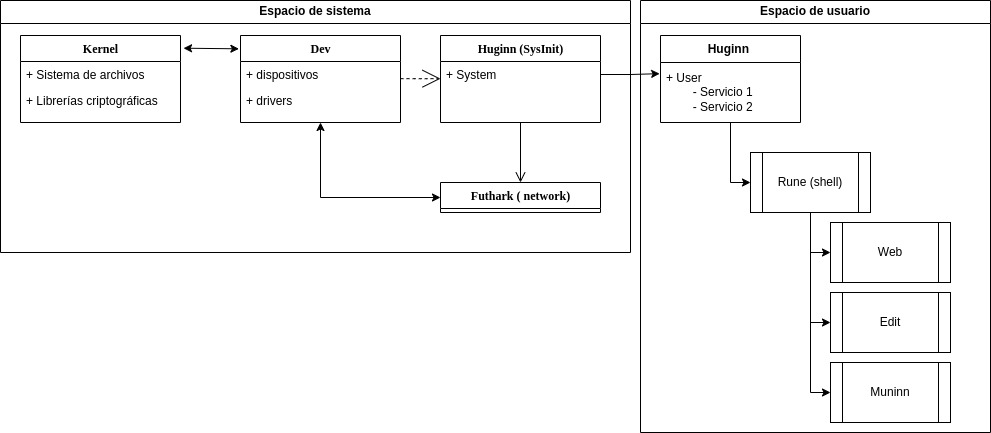

# Arquitectura del sistema operativo

Arriba de las presentes líneas puede usted ver la arquitectura del sistema en forma
de un diagrama simple. Idealmente la arquitectura debe mantenerse tan simple como sea
posible.

El kernel es minimalista; tiene el sistema de archivos, las librerías criptográficas
y los drivers necesarios para que los dispositivos puedan ser montados (en forma de módulos).

El programa "dev" interactua con el kernel para disponibilizar tal dispositivo en forma
de un archivo con la información en forma de; [key] { [value] }

Huginn en su instancia de sistema inicializa todos los servicios considerados de sistema
y el administrador de red; Futhark.

Luego se inicia la instancia de usuario de huginn, inicializando solamente
los servicios de usuario (sin permisos de administrador) que permitirán iniciar sesión
y luego poder usar la shell (Rune) como las utilidades.
